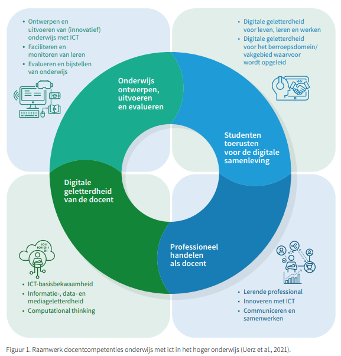

## Raamwerk docentcompetenties

Het [Raamwerk docentcompetenties onderwijs met ict voor het hoger onderwijs](https://www.ixperium.nl/onderzoeken-en-ontwikkelen/publicaties/raamwerk-docentcompetenties-onderwijs-met-ict/) van iXperium beschrijft de relevante docentcompetenties bij het vormgeven van onderwijs dat maatwerk en flexibilisering mogelijk maakt met behulp van ict en dat aansluit bij de steeds veranderende samenleving. Dit raamwerk is verder uitgewerkt in [gedragsindicatoren voor docenten](https://www.ixperium.nl/onderzoeken-en-ontwikkelen/publicaties/competenties-en-gedragsindicatoren-onderwijs-met-ict-voor-docenten-2/). Dit is ook het competentieraamwerk waarvan de competenties op masterniveau gebruikt worden binnen de [HAN Master Ontwerpen Van Eigentijds Leren](https://www.han.nl/opleidingen/master/ontwerpen-van-eigentijds-leren/deeltijd/) .

## Competenties specifiek voor AI

Deze competenties en gedragsindicatoren die voor ict of digitale hulpmiddelen zijn geformuleerd, zijn ook toepasbaar voor **AI in het onderwijs**. Een docent die AI-geletterd is:

- begrijpt wat AI is en hoe het werkt op een niveau dat past bij het vak en de context,
- kan kritisch beoordelen welke AI-tools bruikbaar zijn voor onderwijs en welke niet,
- denkt na over ethische en maatschappelijke implicaties van AI in de lespraktijk,
- kan studenten begeleiden bij het verantwoord en effectief inzetten van AI
- blijft zich professioneel ontwikkelen naarmate de technologie evolueert.

::: {.callout-tip}
## Weet je nog niet waar te beginnen?

Op de pagina [experimenteren en professionaliseren](experimenteren.qmd) vind je bronnen om je als docent verder te ontwikkelen op het gebied van AI.
:::

## Andere AI-geletterdheid raamwerken

Er zijn verschillende raamwerken voor AI-geletterdheid van docenten ontwikkeld. Hieronder een aantal andere voorbeelden:

- [AI GO](https://npuls.nl/kennisbank/ai-go-een-raamwerk-voor-ai-geletterdheid-in-het-onderwijs)
- [AI Literacy Framework](https://ailiteracyframework.org/)
- [AI Competency Framework for Teachers](https://www.unesco.org/en/articles/ai-competency-framework-teachers)

Welke het beste is? Dat is deels een keuze op basis van welke uitgangspunten je belangrijk vindt. Voor een Masterdocent is het iets om binnen de eigen onderwijsorganisatie aan te kaarten en samen met de [leidinggevenden](../leidinggevendencompetenties.qmd) te bespreken.
