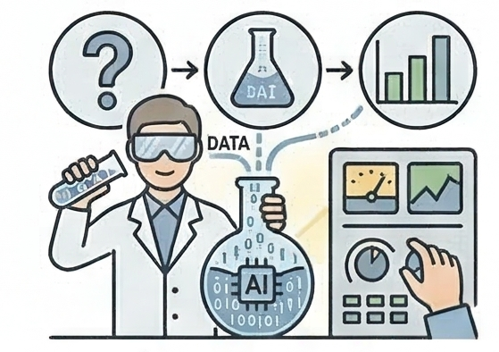
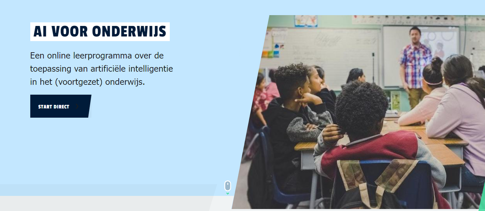
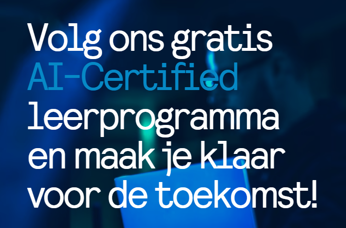
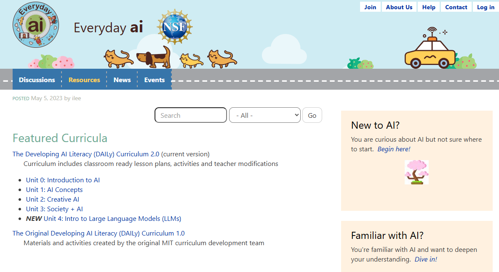
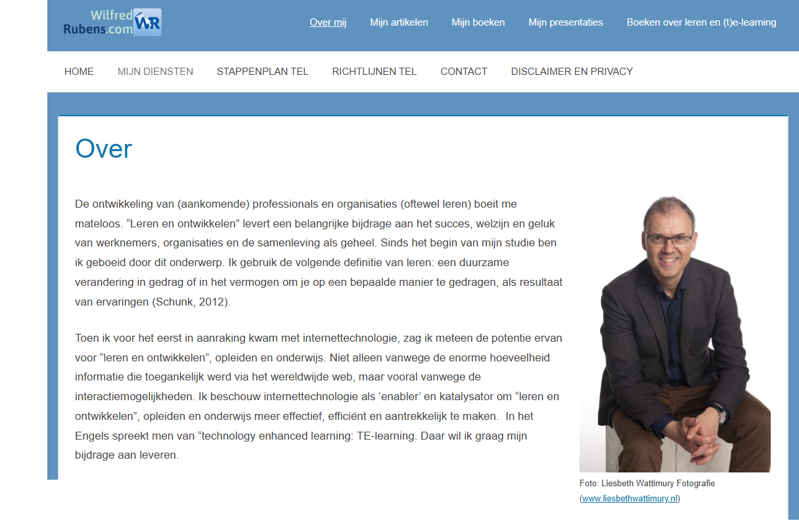

Het is één ding om in deze module te lezen over AI. Uiteindelijk zul je er toch echt mee aan de slag moeten om te ontdekken wat in jouw context en situatie het beste werkt. Natuurlijk, niet alle experimenten zijn verstandig. Maak gebruik van wat we weten, lees literatuur, praat met anderen. Begin klein — niet meteen je hele curriculum of werkwijze omgooien.

En je hoeft het niet alleen te doen. Er is best al veel professionalisering beschikbaar, en die slimme collega (docent of student) kan natuurlijk ook meekijken. Wees niet onder de indruk van wat er allemaal kan of van wat anderen al kunnen.

Hieronder vind je een aantal verwijzingen naar online cursussen en materialen — van introductieniveau tot heel erg technisch. Het is **niet** zo dat je van al die dingen kennis moet hebben of met al die zaken aan de slag moet. Als docent hoef je niet zelf chatbots of adaptieve leersystemen te kunnen bouwen. Als student ook niet. De links zijn er om je een idee te geven van de omvang van het domein. Welk stukje daarvan jij het eerst gaat ontdekken is aan jou.

::: {.callout-caution}

Let op! Experimenteren met AI kan risico's met zich meebrengen. Wees voorzichtig met het installeren van zaken. Dus niet zomaar met OpenClaw aan de slag op je werklaptop!
Meer praktisch: geen persoonsgegevens, geen werkstukken van studenten uploaden naar systemen waar je niet van weet of je organisatie een overeenkomst heeft met de provider over het gebruik van die data. 

:::

Op [de pagina met voorbeelden](../voorbeelden/) vind je nog een aantal voorbeelden van applicaties en omgevingen waar je mee kunt experimenteren.

## AI-cursus voor het onderwijs

De gratis [online AI voor onderwijs cursus](https://www.tech-cursus.nl/app/8-ai-primair-onderwijs/home) richt zich op leraren en docenten uit het funderend onderwijs, maar bevat ook onderwerpen die als inleiding voor anderen relevant zijn.

::: {.callout-note}
De cursus is ontwikkeld voordat ChatGPT beschikbaar kwam, dus je zult er geen onderwerpen in tegenkomen als "wat betekent AI voor toetsing?".
:::

## AI-certified leerprogramma

Het gratis online leerprogramma "AI-Certified" is een initiatief dat erop gericht is om werkend Nederland AI-geletterd te maken, zodat werknemers kunstmatige intelligentie slim, veilig en ethisch kunnen inzetten in hun dagelijkse praktijk. De leerlijn is modulair opgebouwd, sluit aan bij de Europese AI Act en behandelt essentiële onderwerpen zoals de werking van algoritmes, machine learning, effectief 'prompten' en de samenwerking tussen mens en machine.

- [AI-certified leerprogramma](https://www.ai-certified.nl/)
- [Uitleg over het programma door Wilfred Rubens](https://www.te-learning.nl/blog/ai-certified-leerprogramma-voor-onderwijsprofessionals/)

## MIT Responsible AI for Social Empowerment and Education (RAISE)

Een enorme hoeveelheid lesmaterialen rond AI als je het niet erg vindt om in het Engels te lezen.

[MIT RAISE Resources](https://raise.mit.edu/resources/curricula/)

## Crash Course AI

Afspeellijst met 21 video's over Kunstmatige Intelligentie en Machine Learning. In het Engels, soms een beetje flauw, maar meestal heel leuk, interessant en laagdrempelig.



## Wat is een Neuraal Netwerk?

De video is al ruim 8 (!) jaar oud, maar nog steeds een mooie video die uitlegt hoe een computer met behulp van een neuraal netwerk een handgeschreven cijfer kan herkennen:



Wil je liever lezen? Dat kan ook [op de website van 3Blue1Brown](https://www.3blue1brown.com/topics/neural-networks). De vervolgvideo's worden snel veel technischer dan dat je waarschijnlijk wilt weten.

## Wilfred Rubens over AI

Dé bron van informatie over wat er sinds november 2022 over ChatGPT en aanverwante technologieën gepubliceerd is, is ongetwijfeld [het blog van Wilfred Rubens](https://te-learning.nl/tag/artificiele-intelligentie/). De info is laagdrempelig en overzichtelijk en alleen al vanwege de hoeveelheid tijd die hij er dagelijks insteekt verdiend hij hier een shoutout voor.

## Deep Dive: YouTube-kanalen

Sinds de explosie van mogelijkheden op het gebied van generatieve AI is het aantal YouTube-kanalen waar je dagelijks nieuwe informatie kunt vinden over de (technische) mogelijkheden niet meer bij te houden. Hieronder staan een paar voorbeelden van kanalen met echte mensen voor de camera — geen tekst-naar-spraak voice-overs. Klik op de naam of afbeelding om naar het kanaal te gaan.

::: {#youtube-kanalen}
:::
