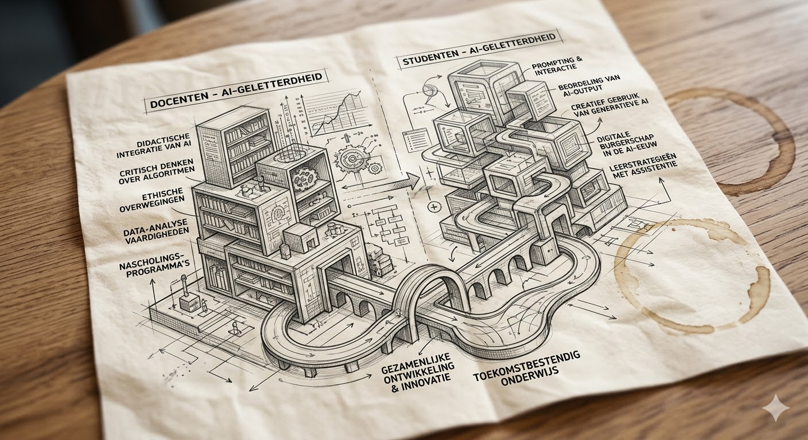

{.lightbox height="200px"}

Sinds de [AI Act](https://artificialintelligenceact.eu/nl/) in werking begint te treden, kom je het begrip **AI-geletterdheid** een stuk vaker in het nieuws en online tegen. Het is het vermogen om AI te begrijpen, kritisch te evalueren en effectief in te zetten in verschillende contexten.
De vraag "Wat moeten docenten en studenten weten over AI?" is ook zonder wetgeving relevant.

We maken daarbij onderscheid tussen de [docentcompetenties](docentcompetenties.qmd), de [studentcompetenties](studentcompetenties.qmd) en de [competenties van leidinggevenden](leidinggevendencompetenties.qmd).

## Wat is AI-geletterdheid?

Wat AI-geletterdheid precies is wordt beschreven in verschillende raamwerken. De exacte invulling kan verschillen van wie het raamwerk heeft opgesteld en de doelgroep (docenten, studente, leidinggevenden, ondersteuners, etc.). AI-geletterdheid kan gezien worden als een onderdeel van **digitale geletterdheid**, maar dan specifiek gericht op kunstmatige intelligentie. En net als bij digitale geletterdheid gaat het bij AI-geletterdheid niet alleen om het kunnen bedienen of gebruiken van AI. We hebben het over competenties: de combinatie van kennis, vaardigheden en houding. En het gaat om AI-geletterdheid **voor leven, leren en werken**, dus in de schoolse context, maar ook daarbuiten.

Op de pagina over [experimenteren en professionaliseren](experimenteren.qmd) in deze module wordt ingegaan op het belang van ervaring met AI. Het helpt als je een bepaalde hoeveelheid ervaring hebt met wat AI kan en niet kan. Anders wordt het heel moeilijk om in te schatten wat realistisch is en wat mooie verhalen van leveranciers of juist horrorverhalen uit fictionele films en toekomstbeelden zijn. Het helpt je ook om te bepalen of je AI in wilt zetten in je lessen (of bij het leren) en hoe je dat dan zou willen doen.

Maar nadenken over ethische aspecten van AI, de vraag waar je wel of geen AI in wilt zetten, hoe we willen dat onze toekomst er uit gaat zien als de ontwikkelingen rond AI zo door blijven gaan — en daar dan een mening over hebben en formuleren — valt ook onder AI-geletterdheid. Neem daarvoor zeker ook een kijkje bij de sectie [AI in de film](../ai-in-de-film/index.qmd). Films zijn weliswaar fictie, ze kunnen ons helpen bij het dromen over mogelijke toekomsten en ons woorden geven om te beschrijven wat we belangrijk vinden om te behouden.

## Achtergrondmateriaal

Dit onderdeel over AI-geletterdheid bevat ook veel achtergrondmateriaal. Soms laagdrempelig, zoals de Crash Course AI of het weblog van Wilfred Rubens, soms heel technisch. Net als andere domeinen is de vraag wat "kennis van" betekent minder eenduidig te beantwoorden dan je denkt. Het hangt er namelijk sterk vanaf wat je met die kennis wilt doen. En zoals in het [colofon](../colofon.qmd) al aangegeven, tips, input en suggesties zijn van harte welkom.

## In dit onderdeel

- [Docentcompetenties](docentcompetenties.qmd) — wat vraagt AI van leraren en docenten? 
- [Studentcompetenties](studentcompetenties.qmd) — Kerndoelen en de DigComp
- [Competenties leidinggevenden](leidinggevendencompetenties.qmd) — de rol van de schoolleider
- [Experimenteren en professionaliseren](experimenteren.qmd) — verdiepende bronnen
