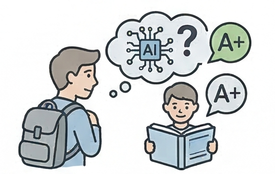
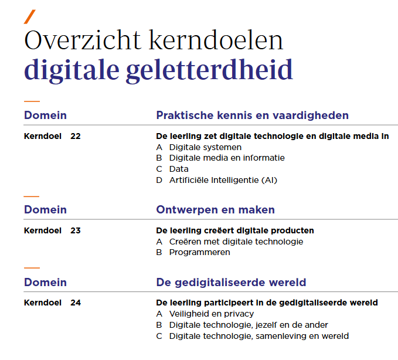
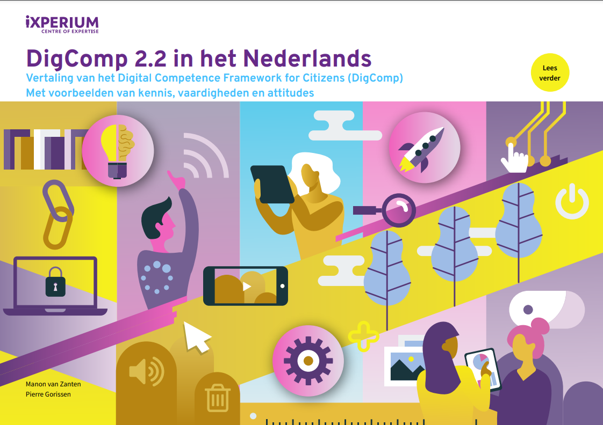

{.lightbox height="200px"}

## Kerndoelen digitale geletterdheid

De nieuwe [kerndoelen digitale geletterdheid](https://www.slo.nl/onderwerpen/onderwijsinhoud/kerndoelen/kerndoelen-digitale-geletterdheid) voor het primair onderwijs en (de onderbouw van) het voortgezet onderwijs zijn vastgesteld en worden vanaf 2027 verplicht. 

{.img-fluid .rounded}

In deze kerndoelen komt kunstmatige intelligentie nu expliciet voor. Dat is een belangrijke ontwikkeling, want het betekent dat aandacht voor de AI-geletterdheid van leerlingen op termijn, via de kerndoelen, een plek in het primair- en voortgezet onderwijs krijgt.

## DigComp 3.0 

Voor het mbo en het hoger onderwijs is er geen sprake van een verplicht competentieprofiel met eindtermen. Een bruikbaar raamwerk is het **Digital Competence for European Citizens 3.0 (DigComp)**. Hierin is veel aandacht voor de rol van kunstmatige intelligentie binnen de verschillende competenties.

Het iXperium heeft een Nederlandse vertaling gemaakt van [versie 2.2](https://www.ixperium.nl/onderzoeken-en-ontwikkelen/publicaties/digcomp-2-2/). De vertaling van versie 3.0 volgt in 2026. Je kunt het raamwerk in het Engels nu al [downloaden](https://publications.jrc.ec.europa.eu/repository/handle/JRC135050) en de voortgang van de vertaling van 3.0 [online volgen](https://github.com/PiAir/digcomp3-l10n).

In dit raamwerk komt in beide versies geen apart competentiegebied AI voor, maar zit de AI-geletterdheid in de vorm van gedragsindicatoren in bijna alle competenties geïntegreerd. Dat is bewust: AI is geen losstaand thema, maar verweven met informatievaardigheden, communicatie, veiligheid en probleemoplossing. Versie 3.0 heeft hier nog meer aandacht voor dan versie 2.2.

::: {.callout-note}
## Vijf competentiegebieden in DigComp 2.2 en 3.0

1. **Informatievaardigheden** — vinden, evalueren en beheren van digitale informatie, inclusief AI-gegenereerde content
2. **Communiceren en samenwerken** — via digitale kanalen met aandacht voor digitale identiteit en netiquette
3. **Digitale content creëren** — produceren en bewerken van content, auteursrecht, en coderen
4. **Veiligheid** — apparaten, privacy, gezondheid, milieu en AI-risico's
5. **Problemen oplossen** — technische problemen, creatief gebruik en bijblijven in een veranderende digitale wereld
:::

DigComp is een raamwerk, het is geen leerplan, geen kookboek maar een startpunt voor het vormgeven van je eigen curriculum. Welke onderdelen waar, voor welke studenten, als verplicht onderdeel of optioneel opgenomen worden, dat bepalen opleidingen zelf. Wat *moet* is dan niet afhankelijk van wat de wetgever voorschrijft, maar van wat de opleiding nodig vindt om studenten voldoende AI-geletterd te maken *voor leven, leren en werken*!

## Metacognitieve luiheid en Cognitief offloaden
Relevant bij digitale geletterdheid / AI-geletterdheid van studenten is, dat het niet alleen gaat om het leren van "technische" of procedurele vaardigheden. AI kent namelijk ook risico's, bijvoorbeeld van [cognitief offloaden](https://figshare.uts.edu.au/articles/report/Artificial_intelligence_cognitive_offloading_and_implications_for_education/31302475?file=62363005) of cognitieve luiheid ("ik hoef niet meer zelf na te denkten, dat doe AI voor me"). Voor studenten is het noodzakelijk om over voldoende [metacognitieve vaardigheden](https://www.slo.nl/@23299/metacognitieve-kennis-vaardigheden/) te beschikken. Dat betekent dat ze moeten leren hoe het plannen, monitoren, bijsturen en evalueren van cognitieve taken (zoals bij het leren) werkt. Ze moeten namelijk leren inschatten wanneer/waarvoor het wel of juist niet verstandig is om AI in te zetten. Als dat alleen is "als de docent niet zegt dat het niet mag, dan mag het", dan loopt zo'n student vroeg of laat tegen problemen aan. En omdat we weten dat die metacognitieve vaardigheden zich niet vanzelf ontwikkelen, is het belangrijk dat docenten hier alert op zijn en studenten hierbij helpen.  
