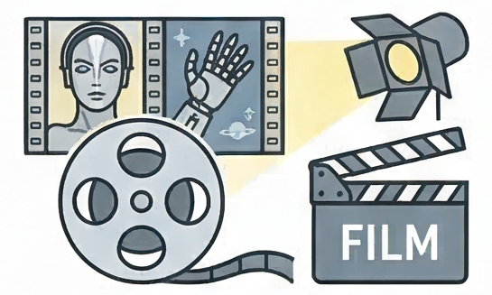

{.lightbox height="200px"}

## De kracht van films

Je vindt hieronder een overzicht van films waar AI een belangrijke rol in speelt. Klik op een titel om er iets meer over te lezen. Een (veel) langere [lijst staat hier](https://en.wikipedia.org/wiki/List_of_artificial_intelligence_films).

Films hebben het vermogen om ons te laten denken over AI, ze kunnen mogelijke toekomsten schetsen. Ze kunnen daarbij ook ons beeld van AI misvormen. Er wordt ook wel eens gesproken over [het Jaws effect voor AI](jaws-effect.qmd). Waarbij de beeldvorming van AI door films sterk negatief is gekleurd. De films hieronder zijn dan ook zeker niet allemaal geschikt om in de klas met leerlingen te bekijken. Het zijn eerder mogelijkheden voor jezelf om je eigen beeld van AI te vormen en te reflecteren op de rol van AI in de samenleving zoals die in films wordt voorgesteld.

## Films

::: {#filmlist}
:::