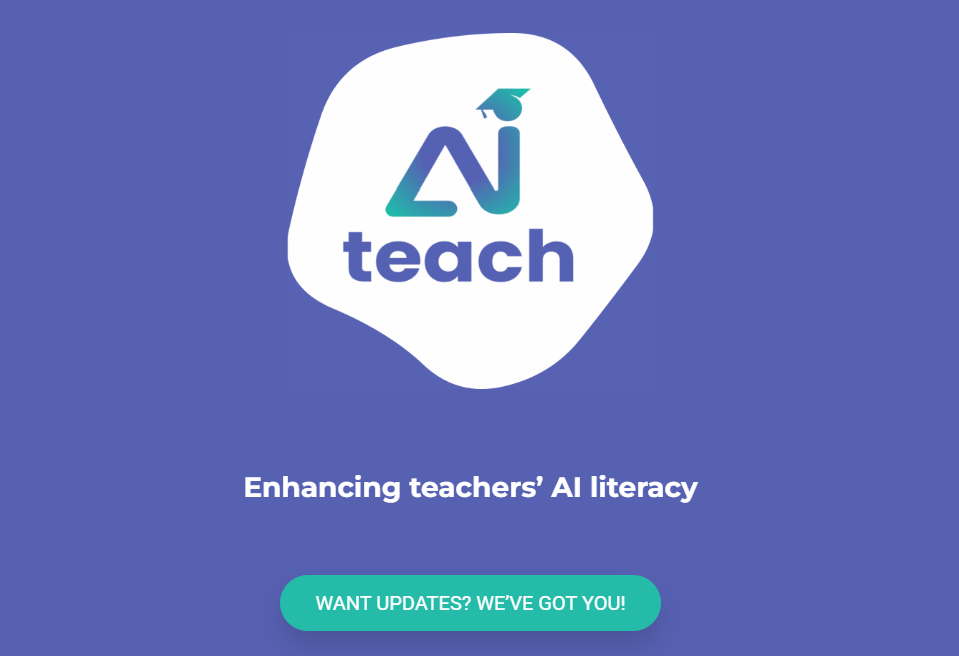

[AI-teach](https://ai-teach.d-teachtraining.com/) is een Erasmus+ Teacher Academy-project dat docenten ondersteunt bij het gebruik van kunstmatige intelligentie in het onderwijs. Het biedt een internationaal programma voor capaciteitsopbouw om de AI-geletterdheid te vergroten onder zowel aankomende als reeds werkende docenten in het voortgezet onderwijs.

Door middel van training, onderzoek en internationale samenwerking helpt AI-teach docenten om AI op een ethische, kritische en creatieve manier in te zetten in hun lespraktijk. De HAN lerarenopleiding is een van de partners in dit project.

## Professionalisering
Het project is op dit moment (maart 2026) nog volop bezig met het ontwikkelen van de professionaliseringsactiviteiten. Je kunt wel al [de rapportage van de mappingstudie](https://ai-teach.d-teachtraining.com/mapping-insights-report/) downloaden en lezen. 

## Pioneering videos
Ook zijn er een aantal 'pioneering videos' gemaakt waarin docenten uit verschillende landen vertellen over hun ervaringen met AI in het onderwijs. Je kunt ze [hier bekijken](https://share.eu.articulate.com/b096EEzdGDgAnkMugkKpk#/).


In deze video hoor je Jochem Hiddink van de HAN over zijn ervaringen met AI in het onderwijs. Hieronder een voorbeeld uit België:


(n.b. YouTube leek deze video als gesproken in het Turks te herkennen en liet de Engelstalige audiotrack horen, dit is toch echt gewoon Vlaams...)

Rechtstreeks toegang tot alle video's vind je [hier](https://www.youtube.com/@AI-teach_Europe/playlists).