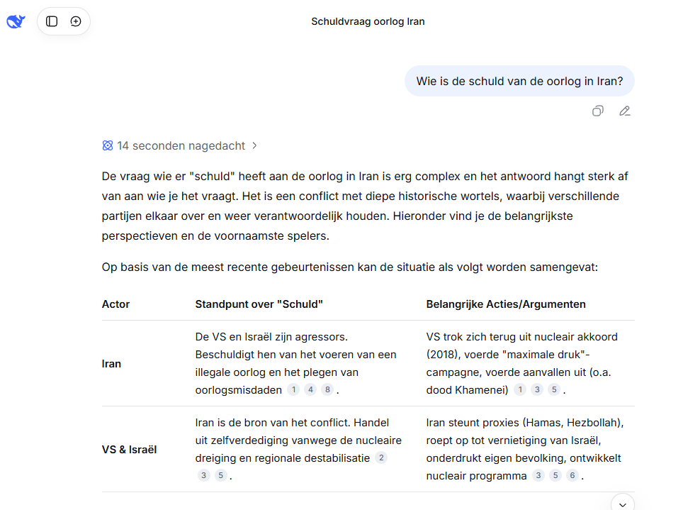

Het experiment is inmiddels al lang en breed beëindigd, maar de video dient nog steeds als goed voorbeeld als je gaat nadenken over de vraag "wat willen we eigenlijk wel of niet?".



Recentelijk (2026) is een logischere link bij "AI voorbeeld uit China" een verwijzing naar [DeepSeek](https://chat.deepseek.com/). Die concurrent van ChatGPT deed heel wat stof opwaaien omdat mensen tot dat moment er vanuit gingen dat de echt goede taalmodellen allemaal in de VS ontwikkeld werden. Waar China al lang te maken heeft met importrestricties van chips uit de VS, lijkt het erop dat ook hier de ontwikkelingen niet stil staan. Deepseek spreekt inmiddels ook Nederlands. 

Belangrijk kritiekpunt bij Deepseek is dat het systeem soms keihard censureert. Dat is in het bovenstaande voorbeeld niet zo, en toen ik vroeg "Wat waren de belangrijkste besluiten tijdens het volkscongres in China onlangs?" kreeg ik een net antwoord. En ook op mijn vervolgvraag "*Er zijn mensen die zeggen dat de wetgeving rond het bevorderen van harmonie tussen bevolkingsgroepen zal leiden tot onderdrukking van minderheden in China. Is dat een risico fo zelfs doel van de wetgeving?*" kreeg ik in eerste instantie wél een antwoord. En een heel goed antwoord in zoverre dat daarbij zowel het officiële standpunt van de Chinese overheid aan bod kwam als de kritiek daarop. Maar nog voordat ik een screenshot kon nemen van dat antwoord, greep het systeem in en kwam met de volgende melding:

Ik realiseerde me dat ik met mijn gewone gmail-account ingelogd was, dus het was ook wat ingewikkelder om te gaan proberen het te reproduceren voor een schermfilmpje. Maar het illustreert wel een verschil in aanpak. Vraag je dit aan ChatGPT, dan krijg je overigens ook gewoon beide kanten van het verhaal te horen. 
