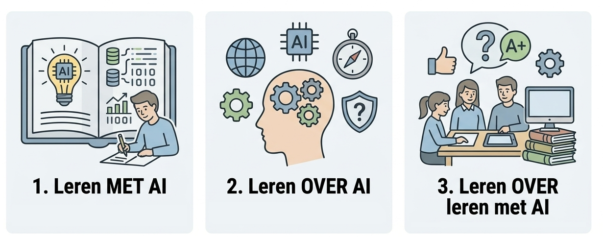
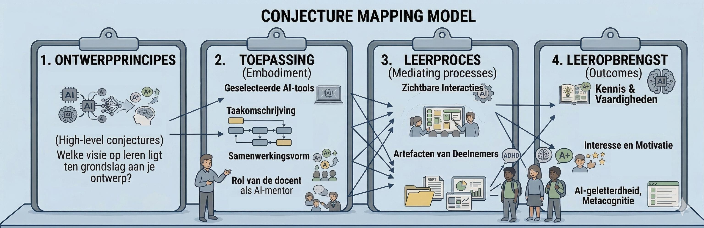
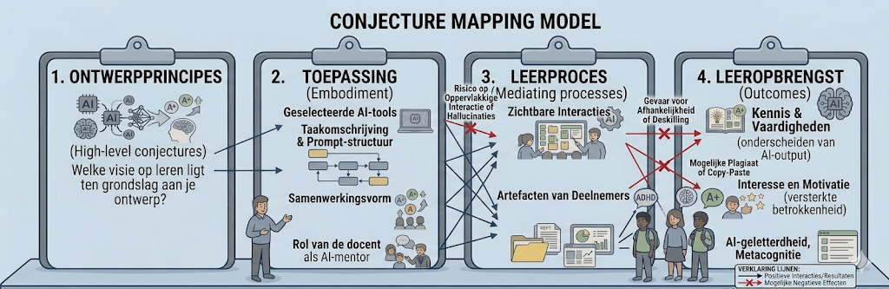

De komst van (generatieve) AI is geen tijdelijke storm die overwaait. Het is een fundamentele verschuiving in hoe we kennis creëren, bewerken en toetsen. Voor het onderwijs, voor studenten aan de MOVEL, betekent dit dat "losse reparaties" aan een curriculum niet langer volstaan. Dat is symptoombestrijding, tijd voor structureel herontwerp.

## Vier Niveaus van Respons

{.lightbox height="200px"}

We kunnen vier niveaus onderscheiden in de manier waarop een onderwijsinstelling op AI reageert: 

  * **Negeren:** Doen alsof er niets veranderd is. Het risico is dat er een groeiende kloof ontstaat tussen wat de student leert en de realiteit van de buitenwereld, plus een onhoudbare toetsdruk door onzichtbaar AI-gebruik.
  * **Verbieden:** AI wordt geweerd uit de klas en van opdrachten. Dit kan zinvol zijn bij specifieke basisvaardigheden (bijv. leren rekenen of spellen), maar als algemeen beleid is het vaak een illusie en remt het de broodnodige AI-geletterdheid.
  * **Aanpassen:** Bestaande opdrachten worden "ge-tweakt". Bijvoorbeeld: "Je mag ChatGPT gebruiken, maar je moet de prompts bijvoegen." Dit is een begrijpelijke tussenstap, maar verandert de kern van het leren nog niet.
  * **Herontwerpen:** De fundamentele vragen worden gesteld. Als AI dit kan, wat moeten onze studenten dan nog zélf kunnen? Hoe verandert de relatie tussen mens en machine in dit vakgebied? Dit is het domein van de MOVEL-ontwerper.

Als je [het SAMR-model](https://te-learning.nl/tpack-en-samr-helder-uitgelegd/) (Substitution, Augmentation, Modification, Redefinition) kent, dan zul je de "herontwerpen" stap herkennen als gelinkt aan de Redefinition stap uit SAMR.

## De driedeling van Holmes

Wayne Holmes maakt in zijn werk over AI in het onderwijs een belangrijk onderscheid tussen drie manieren waarop de technologie een rol speelt (zie ook [Holmes et al., 2022](https://www.researchgate.net/publication/364994764_State_of_the_art_and_practice_in_AI_in_education)). 

* **Leren met AI** (Learning with AI): Het gebruik van AI-toepassingen om vakinhoudelijke kennis te verwerven (bijv. een adaptieve oefenset voor wiskunde).
* **Leren over AI** (Learning about AI): Het begrijpen van de techniek, de algoritmes en de data achter AI-systemen (AI-geletterdheid).
* **AI om te leren over leren** (Using AI to learn about learning): In plaats van simpelweg "voorbereiden op de toekomst", verschuift de focus naar hoe AI-data ons inzicht kan geven in hoe studenten daadwerkelijk leren. Dit helpt bij het verbeteren van de didactiek en het begrijpen van cognitieve processen.

Deze driedeling van AI-gebruik helpt om expliciet te maken welke rol AI speelt in het onderwijsontwerp en welke leermechanismen je verwacht te activeren. Dit sluit direct aan bij het denken in conjecture maps (zie hieronder). Het [curriculaire spinnenweb](spinnenweb.qmd) laat zien welke curriculumcomponenten meebewegen wanneer AI wordt ingezet (van doelen en inhoud tot activiteiten, rolverdeling en toetsing). Zo vormt de driedeling van Holmes een compacte kapstok om AI‑keuzes zowel ontwerpgericht als curriculair samenhangend te onderbouwen. Binnen het [AI-teach](/ai-in-het-onderwijs/organisaties/ai-teach.qmd)-project wordt deze driedeling gebruikt om de professionaliseringsactiviteiten voor docenten vorm te geven en in te delen.

## De Ontwerpmethode: Conjecture Mapping

Voor het herontwerpen van ict-ondersteund onderwijs of onderwijs met AI kun je gebruik maken van **Conjecture Mapping** ([Sandoval, 2014](https://www.tandfonline.com/doi/abs/10.1080/10508406.2013.778204)). Deze methode dwingt je om je aannames (*conjectures*) over hoe technologie het leren ondersteunt, expliciet te maken.

### De vier elementen voor jouw AI-ontwerp:

1.  **Ontwerpprincipes (Design Principles)**
    * De visie achter de interventie: Waarom doen we dit eigenlijk? Welk onderwijskundig probleem lost de AI-interventie op? *Bijvoorbeeld: tijdsgebrek voor feedback, gebrek aan differentiatie*
    * Verandert je pedagogische visie? Word je meer een coach/facilitator nu de AI de 'inhoud' of de 'instructie' overneemt? 
    * Welke waarden staan centraal? *Bijvoorbeeld: autonomie van de student, kritisch denken, of juist efficiëntie.* 

2.  **Toepassing (Embodied Design)**
    * De concrete vorm: Hoe ziet het er in de praktijk uit?
    * Hoe en wanneer komt de student in aanraking met de AI? Is het een verplicht onderdeel van de les of een ondersteunende tool voor thuis? 
    * Wat heeft de student naast de AI-interventie nog meer nodig? *Bijvoorbeeld: een instructievideo, een bronnenlijst, of een reflectiekader.* 
    * Wordt de opdracht zelf fundamenteel anders? *Bijvoorbeeld: van "schrijf een verslag" naar "ontwerp een master-prompt".* 

3.  **Leerproces (Mediating Processes)**
    * De psychologie: Wat gebeurt er in het hoofd van de student?
    * Welke acties voert de student uit die hij/zij zonder AI niet zou doen? 
    * Bijvoorbeeld: dieper doorvragen door de Socratische methode. 
    * Neemt de AI 'denkwerk' over dat de student eigenlijk zelf zou moeten doen, of maakt het juist ruimte voor hogere denkorden? 
    * Hoe beïnvloedt de AI de betrokkenheid? Voelt de student zich meer gesteund (AI-tutor) of juist meer uitgedaagd (advocaat van de duivel)? 

4.  **Leeropbrengst (Learning Outcomes)**
    * Het resultaat: Wat beheerst de student aan het eind?
    * Kwaliteit: Is het eindproduct van een hoger niveau door de AI-ondersteuning? 
    * Nieuwe competenties: Leert de student nu ook vaardigheden die eerst niet in het curriculum zaten? *Bijvoorbeeld: AI-geletterdheid, herkennen van bias.* 
    * Beoordeling: Kunnen we de oude toetsvorm nog wel gebruiken? Als het leerproces verandert, moet de manier waarop we "succes" meten dan ook veranderen? Hoe onderscheid je de groei van de student van de geproduceerde AI-output?

::: {.callout-note collapse="true"}
## Negatieve effecten van AI

Je kunt conjecture mapping ook gebruiken om na te denken over de mogelijke negatieve effecten van AI in het onderwijs. Door te signaleren wat er mis kan gaan, kun je ook nadenken over hoe je dit kunt voorkomen. 
:::

::: {.callout-note collapse="false"}
## De samenhang met het spinnenweb
Waar het [Curriculair Spinnenweb](spinnenweb.qmd) laat zien *wat* er in samenhang moet veranderen, legt de Conjecture Map uit *waarom* je verwacht dat die verandering tot leren leidt.
:::

Herontwerpen vraagt om een hoge mate van AI-geletterdheid. Je kunt pas ontwerpen met een tool als je de grenzen, de ethiek en de mechanica ervan begrijpt. 

## Dialoog
Belangrijk bij het herontwerpen is de dialoog met collega's en studenten. Antwoorden op keuzes liggen niet vast, maar zijn afhankelijk van de context en de visie op leren. Hieronder staan een aantal voorbeelden van dilemma's die je kunt gebruiken om de dialoog te starten.

  * **Het Verbod:** Een school verbiedt AI voor alle schrijfopdrachten.
      * *Vraag:* Wat betekent dit voor de authenticiteit van de taak? Bereiden we leerlingen nog wel voor op een wereld waarin professioneel schrijven bijna altijd hybride is?
  * **De Volledige Integratie:** Een docent integreert AI volledig in een project dat studenten uitvoeren.
      * *Vraag:* Welke draden van het spinnenweb moeten meebewegen? (Denk aan: Toetsing, Tijd, en vooral de Rol van de leraar).
  * **AI-Proof Toetsen:** Een opleiding wil fraude voorkomen door alles on-site op papier te laten doen.
      * *Vraag:* Is dit een duurzame oplossing, of verkleinen we hiermee de leeromgeving tot een kunstmatige bubbel?
