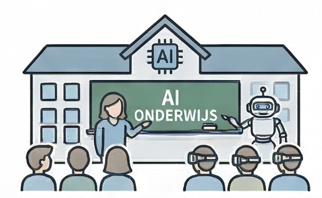
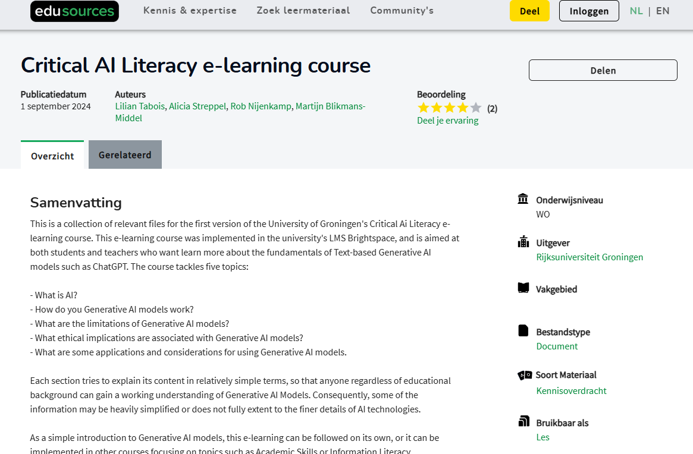

{.lightbox height="200px"}

## De lijst wordt langer...
Voor de eerste versie van deze  online module voor lesjaar 2022-2023, ontwikkeld net nadat [ChatGPT](../voorbeelden/chatgpt.qmd) op de markt kwam, was het heel moeilijk om voorbeelden te vinden van toepassingen van AI die speciaal voor het onderwijs ontwikkeld waren. De lijst met voorbeelden is nog steeds korter dan de lijst [voorbeelden van algemene AI](../voorbeelden/index.qmd) die je in deze module kunt vinden.

En natuurlijk: AI toepassingen die niet specifiek voor het onderwijs ontwikkeld zijn, zijn vaak ook heel goed ten behoeve van het onderwijs in te zetten. Bij het [Nationaal Onderwijslab AI](nolai.qmd) lopen inmiddels vele co-creatieprojecten waarbij scholen, wetenschappers en bedrijven samen onderwijs-AI ontwikkelen.

## Inleiding

Mocht je de inleiding van de module over [AI in het onderwijs](../inleiding/ai-onderwijs.qmd) nog niet gelezen hebben, dan is het goed om dat nu alsnog te doen. De video die daarin centraal staat, geeft een goed beeld van de stand van zaken rondom AI in het onderwijs. De video is van januari 2025, maar geeft nog steeds een goed beeld van de stand van zaken rondom AI in het onderwijs.

## AI materialen bij Edusources

Op [Edusources.nl](https://edusources.nl/) delen docenten en vakcommunity's onderwijsmaterialen in het hoger onderwijs. Daar is inmiddels ook het nodige materiaal over kunstmatige intelligentie te vinden, zoals de [cursusmaterialen van de Rijksuniversiteit Groningen](https://edusources.nl/materials/2bee669c-264e-461b-af05-2f54351496d1/critical-ai-literacy-e-learning-course) of deze [materialen van de HAN University of Applied Sciences](https://edusources.nl/materials/search?filters=[{%22external_id%22:%22publishers.keyword%22,%22items%22:[%22HAN+University+of+Applied+Sciences%22]}]&page=1&page_size=10&search_text=AI).

Samen ontwikkelen is heel belangrijk om te voorkomen dat wij in Nederland systemen ontwikkelen zoals het inmiddels [heel bekende voorbeeld uit China](china-voorbeeld.qmd).

## AI in het onderwijs voorbeelden

Hieronder vind je een aantal voorbeelden van producten en initiatieven op het gebied van AI in het onderwijs.

::: {#ai-in-het-onderwijs-voorbeelden}
:::
