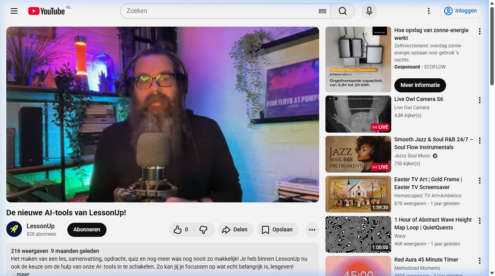

[LessonUp](https://www.lessonup.com) is een populair platform voor interactieve lessen in Nederland. Ze hebben onlangs AI-functies toegevoegd die docenten enorm veel tijd kunnen besparen.

Met LessonUp AI kun je:
- **Automatisch quizes genereren** op basis van een onderwerp of tekst.
- **Interactieve slides maken** met hulp van AI.
- **Lesdoelen formuleren** die aansluiten bij het curriculum.

### Hoe het werkt
Bekijk hieronder hoe LessonUp AI docenten ondersteunt:

::: {layout-nw="[1,1]"}



:::

## Disclaimer

Ook voor LessonUp geldt dat deze tekst geschreven is op basis van heel beperkte handson ervaring.

