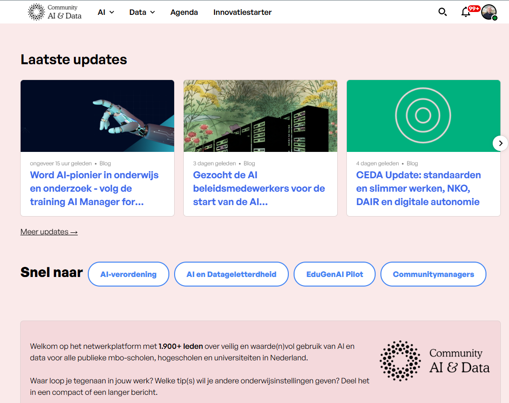

Npuls wordt net als [NOLAI](nolai.qmd) mogelijk gemaakt vanuit het Nationaal Groeifonds dat er naar streeft om het onderwijs in Nederland te versterken door innovatie, samenwerking en digitale vaardigheden te bevorderen. 

### AI en Data

Een van de programmaonderdelen is [AI en Data](https://npuls.nl/ai-en-data/) met daarbinnen weer een aantal programmalijnen en ook een [Community Data en AI](https://community-data-ai.npuls.nl/) gericht op alle publieke mbo-instellingen, hogescholen en universiteiten in Nederland.

Daar vind je onder andere:

- Een **vraagbaak AI** voor al je brandende vragen.
- Een **agenda** met relevante events.
- **Blogposts** over de nieuwste ontwikkelingen in het Nederlands onderwijs.
- Informatie over de verschillende **deelprojecten**.

### EduGenAI pilot

EduGenAI is een Nederlands platform met als doel om een eigen veilige en verantwoorde toepassing voor generatieve AI in het vervolgonderwijs te ontwikkelen. Met dit platform kunnen onderwijsinstellingen gebruik maken van commerciële en open source taalmodellen.  

