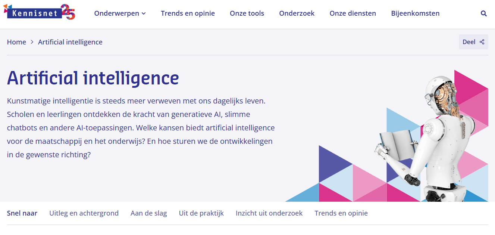

[Kennisnet](https://www.kennisnet.nl/artificial-intelligence/) richt zich specifiek op het funderend onderwijs. Maar zoals [Npuls](npuls.nl) niet alleen interessant is als je in het mbo of hoger onderwijs werkt, is ook Kennisnet een bezoek voor docenten uit andere onderwijssectoren de moeite waard. 

Kennisnet heeft een aantal interessante pagina's over AI en onderwijs. Hieronder een selectie:

- [AI in het onderwijs](https://www.kennisnet.nl/artificial-intelligence/)
- [Aandachtspunten bij de ontwikkeling van je curriculum en de invloed van AI](https://www.kennisnet.nl/artificial-intelligence/aandachtspunten-bij-de-ontwikkeling-van-je-curriculum-en-de-invloed-van-ai/)
- [Werken aan AI-geletterdheid op school](https://www.kennisnet.nl/artificial-intelligence/werken-aan-ai-geletterdheid-op-school/)
- [AI Impact Game](https://www.kennisnet.nl/tools/ai-impact-game/)
- [Ethiekkompas](https://www.kennisnet.nl/tools/ethiekkompas/) - niet specifiek over AI, maar net zo relevant voor AI-toepassingen
- [AI-companions](https://www.kennisnet.nl/trends/ai-companions-kunstmatige-intelligentie-als-vriend-en-therapeut/)


