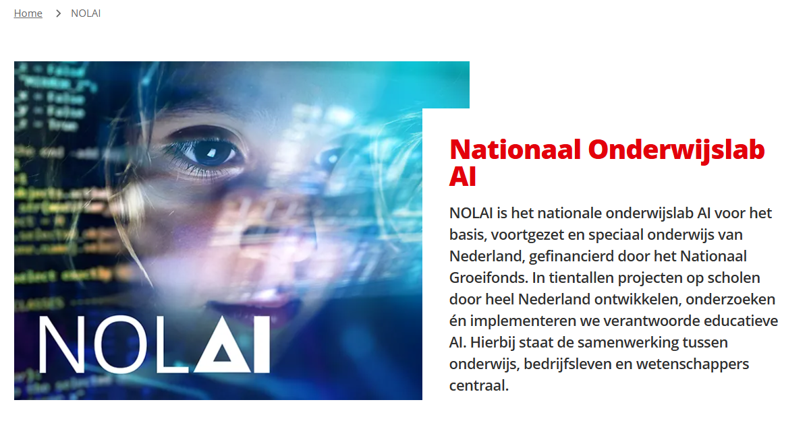
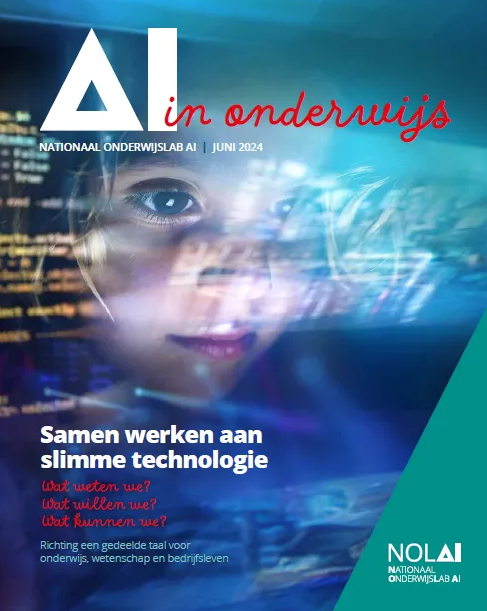
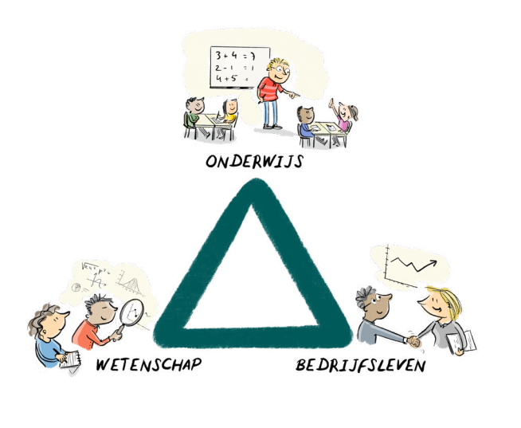

NOLAI is het nationale onderwijslab voor AI in het basis-, voortgezet en speciaal onderwijs, gefinancierd door het Nationaal Groeifonds. Op scholen leven veel vragen over AI. NOLAI brengt onderwijs, wetenschap en bedrijfsleven samen in kortlopende projecten om AI-toepassingen te ontwikkelen en te onderzoeken. Het doel is een bewuste en verantwoorde inzet van AI in de klas.

### Onderzoek en ontwikkeling

Co-creatieprojecten helpen bij de ontwikkeling van AI-technologieën die het onderwijs ondersteunen. Tegelijkertijd wordt onderzocht wat de pedagogische, maatschappelijke en sociale impact is van AI in de klas.

### Partners en financiering

NOLAI is een consortium van strategische partners (waaronder de HAN) en projectpartners, geleid door de Radboud Universiteit. De financiering komt van de Europese Unie (NextGenerationEU) en het Nationaal Groeifonds, met in totaal € 143 miljoen toegekend tot 2032. De ministeries van EZK en OCW geven advies via een programmaraad.

### Waarom een onderwijslab voor AI?

AI wordt steeds vaker ingezet in het onderwijs. Dit biedt kansen, maar roept ook vragen op. Hoe blijft de leraar de regie houden? Hoe beïnvloedt AI wat en hoe leerlingen leren? NOLAI onderzoekt deze ontwikkelingen in de praktijk en zoekt naar een evenwichtige samenwerking tussen mens en technologie.

## NOLAI magazine

In een jaarlijks magazine deelt NOLAI haar wetenschappelijk verantwoorde meetlat waarlangs we nieuwe en bestaande educatieve AI leggen, en haar laatste inzichten en ontwikkelingen. De versies van 2024 en 2025 zijn nu online verkrijgbaar als pdf.

Het leren van de leerling en het lesgeven van de leraar vormen de uitgangspunten voor NOLAI en haar partners. Samen beantwoorden we de volgende vragen:

- Wat weten we? Welke wetenschappelijke kennis is beschikbaar?
- Wat kunnen we? Welke educatieve AI is beschikbaar? 
- Wat willen we? Welke vragen stelt het onderwijs ons nu?

Met educatieve AI wordt AI bedoeld die specifiek voor onderwijs is ontwikkeld, bijvoorbeeld door educatieve uitgeverijen of Nederlandse EdTech-bedrijven.

## Samen ontwikkelen

Het samen, in een multidisciplinair team, ontwikkelen of herontwerpen van onderwijs is een bewezen effectieve werkwijze. Binnen iXperium vindt dit plaats binnen [iXperiumdesignteams](https://www.ixperium.nl/onderzoeken-en-ontwikkelen/ixperium-designteams/). Binnen NOLAI wordt ingezet op co-creatieprojecten waarbij wetenschap, onderwijs en bedrijfsleven samen werken aan oplossingen voor problemen en uitdagingen in het onderwijs.

Een overzicht van de projecten van NOLAI [is hier te vinden](https://www.ru.nl/nolai/projecten).
