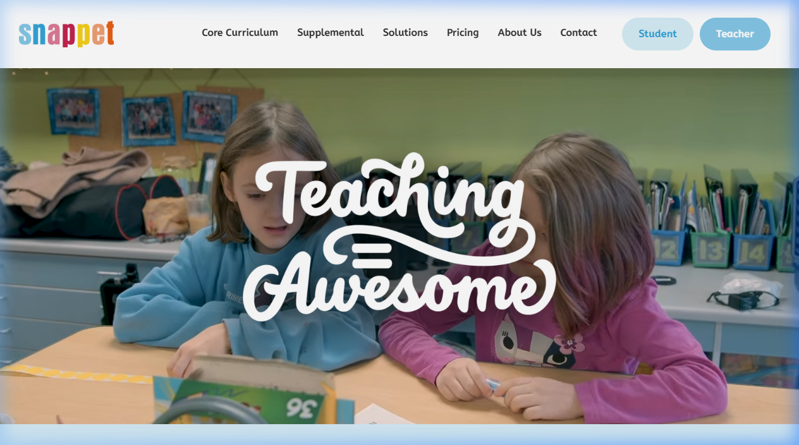

[Snappet](https://www.snappet.org/) is een bekende speler in het basisonderwijs. In samenwerking met [NOLAI](nolai.qmd) wordt **Snappet Copilot** in de praktijk getest. 

De focus van Snappet Copilot ligt op:

- **Inzicht**: De leraar krijgt suggesties over welke leerling extra hulp nodig heeft.
- **Differentiatie**: Automatische aanpassingen in het niveau van de opdrachten.
- **Tijdswinst**: Automatisering van administratieve taken zodat er meer tijd is voor pedagogisch contact.

[Lees hier meer over de pilot en de implementatie](https://www.ru.nl/onderzoek/onderzoeksprojecten/co-implementatiepilot).
