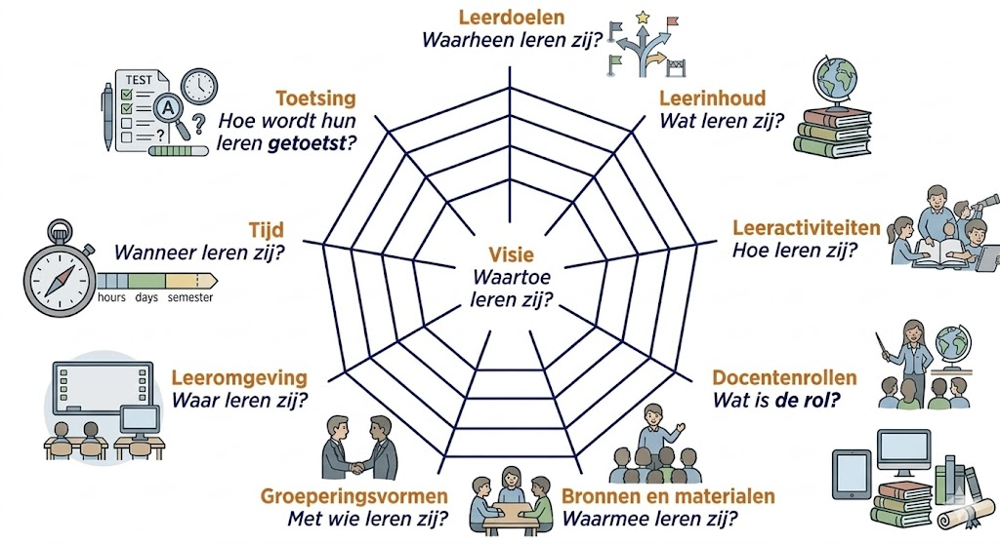

Als student van MOVEL heb je ongetwijfeld gehoord van het [curriculaire sppinnenweb](https://www.slo.nl/thema/vakspecifieke-thema/kunst-cultuur/leerplankader-kunstzinnige-orientatie/handreiking-schoolleiders/curriculaire-spinnenweb/) van Van den Akker (2003).

{.lightbox height="200px"}

Het curriculaire spinnenweb is een heel bruikbaar model om te begrijpen hoe de integratie van AI veel verder gaat dan alleen het aanschaffen van een nieuwe tool. Het model stelt dat een curriculum bestaat uit een centrale visie en negen samenhangende aspecten. Wanneer AI wordt geïntroduceerd, heeft dit invloed op elk van deze onderdelen. Bij de komst van AI moet een school of een docent zich afvragen: *Waarom gebruiken we AI?* Is het om de efficiëntie te verhogen, om studenten voor te bereiden op de toekomstige arbeidsmarkt, of om gepersonaliseerd leren mogelijk te maken? Zonder een heldere visie zwiepen de andere draden ongecontroleerd heen en weer.

### De metafoor van het spinnenweb

Het spinnenweb illustreert dat een leerplan flexibel maar kwetsbaar is. In relatie tot AI betekent dit:

-   **Samenhang:** Als je AI alleen inzet bij de 'Inhoud' (bijv. leren over prompts), maar de 'Toetsing' (bijv. papieren examens) niet aanpast, raakt het web uit balans.

-   **Spanning:** Als er te hard aan één draad wordt getrokken (bijvoorbeeld een eenzijdige focus op AI-tools zonder naar de 'Rol van de docent' te kijken), dreigt het curriculum te "scheuren". Vernieuwing slaagt alleen als alle draden evenredig meebewegen.

In de onderstaande tabel zie je hoe de kernvragen van het spinnenweb verschuiven door de invloed van AI:

| Leerplanaspect | Kernvraag met AI-focus |
|:-------------------|:--------------------------------------------------|
| **Visie** | Waarom willen we AI integreren in ons onderwijs? Waartoe leren leerlingen nog als AI veel kennistaken overneemt? Wat is het doel van onderwijs in een AI-tijdperk? |
| **Doelen** | Welke nieuwe AI-geletterdheid moeten leerlingen beheersen? Welke doelen verliezen aan belang, welke worden urgenter (kritisch denken, prompten, bronbeoordeling)? |
| **Inhoud** | Wat moeten leerlingen nog weten als AI alle feiten paraat heeft? |
| **Leeractiviteiten** | Hoe gebruiken leerlingen AI-tools om te creëren of te analyseren? Hoe veranderen werkvormen als AI meewerkt aan producten? |
| **Docentrol** | Verandert de docent van kennisoverdrager naar AI-coach? AI als co-docent? |
| **Bronnen & Materialen** | Welke AI-software en licenties zijn er nodig (en veilig)? AI als bron; betrouwbaarheid, hallucinaties, auteursrecht. |
| **Groeperingsvormen** | Maakt AI individuele leerpaden in een volle klas makkelijker? Samenwerking met én naast AI; individueel werk opnieuw gedefinieerd. |
| **Tijd** | Hoeveel tijd kost het aanleren van AI-vaardigheden versus vakinhoud? AI versnelt bepaalde taken; wat doe je met de vrijgekomen tijd? |
| **Locatie** | Kan het leren nu overal plaatsvinden met een AI-tutor? Fysiek vs. digitaal; wanneer bewust AI-vrij? |
| **Toetsing** | Hoe toetsen we nog op een eerlijke manier (proces vs. product)? |

AI in het onderwijs is geen losstaande tool, maar een operatie aan het gehele curriculaire systeem. Succesvolle integratie vereist dat elke "draad" van het spinnenweb wordt meegenomen om de balans te bewaren. Zie ook de bijdrage [AI als spin in het web: Implicaties van ChatGPT voor het curriculum](https://community-data-ai.npuls.nl/file/download/374d6963-5934-4dd7-82ab-a5702f691a56/ai-als-spin-in-het-web.pdf) van Kim Schildkamp over de rol van generatieve AI voor het curriculum.