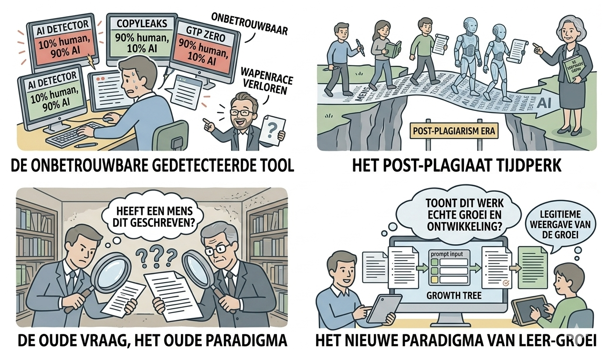
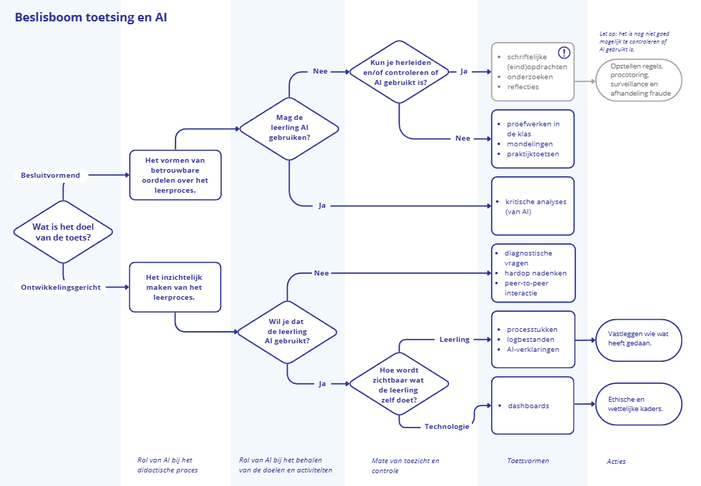
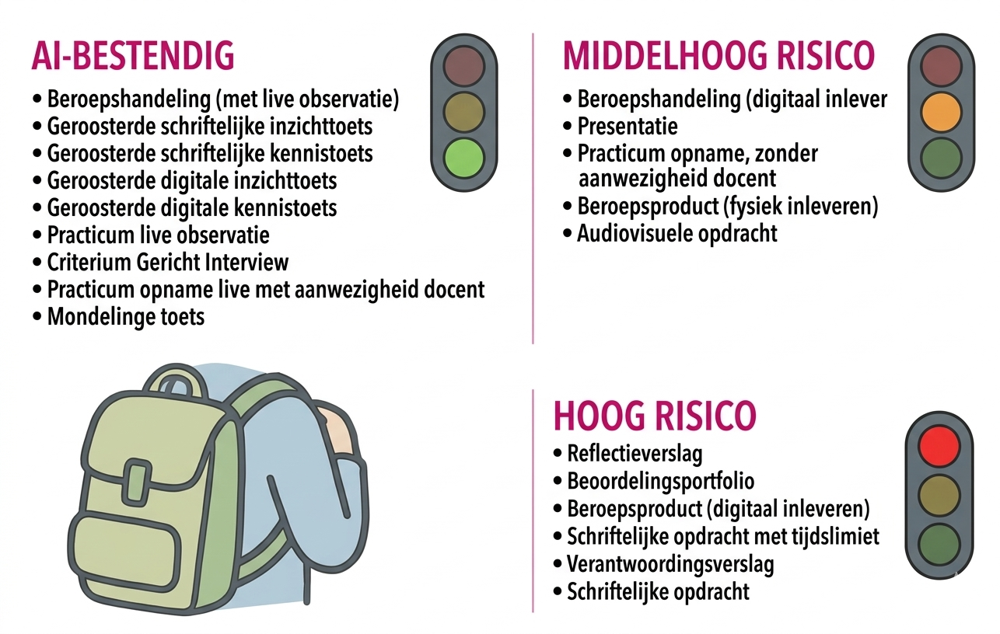
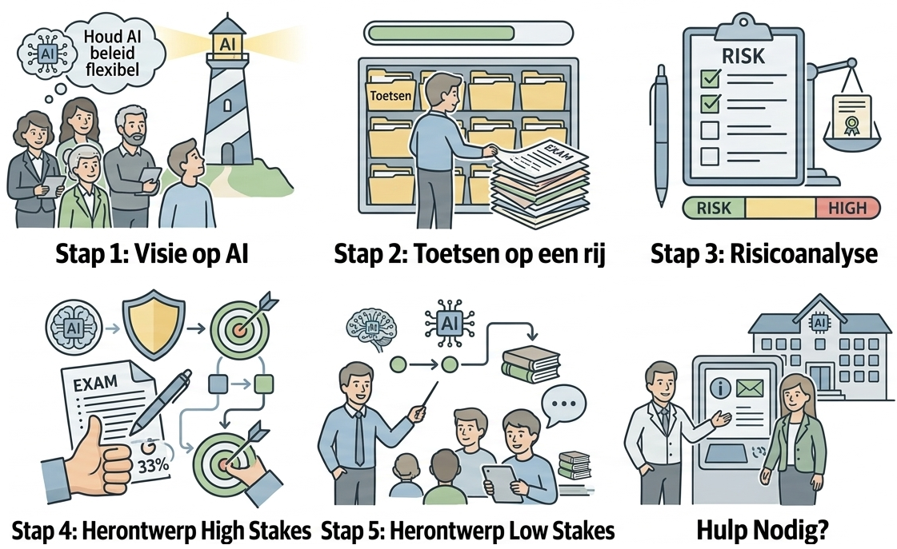

In het AI-tijdperk moet de focus van toetsing verschuiven van de controle op het eindproduct naar de validatie van het leerproces. De shift dus van fraudedetectie naar leerbevestiging.

## Detectietools zijn onbetrouwbaar

{.lightbox height="200px"}

Lubach [wist het](/inleiding/lubach.qmd): detectietools voor het gebruik van AI door studenten zijn onbetrouwbaar. En je komt als docent in een wapenrace terecht die je toch niet kunt winnen. Sarah Elaine Eaton (Universiteit van Calgary) noemt het het "[post-plagiarism era](https://postplagiarism.com/)". Een tijdperk waarin de grens tussen menselijke en AI-tekst onherstelbaar is vervaagd. De verschuiving: We vragen niet langer "Heeft een mens dit geschreven?", maar "Is dit werk een legitieme weergave van de groei van deze student?".

## Toetsingsstrategieën

De [Beslisboom Toetsing en AI](https://www.kennisnet.nl/app/uploads/Beslisboom-toetsing-en-AI.pdf) van Kennisnet helpt bij het maken van bewuste keuzes per toetsmoment. Er wordt soms van 2-sporenbeleid gesproken, je zou ook kunnen zeggen dat er 3 sporen zijn doordat je AI ook kunt inzetten als instrument ter ondersteuning van het leerproces.

**Spoor 1: AI Uitsluiten** (Gecontroleerd) *Wanneer:* Bij het toetsen van fundamentele basiskennis of vaardigheden die de student 'kaal' moet beheersen (bijv. medische basiskennis of rekenvaardigheid). *Hoe:* On-site toetsing, mondelingen, of pen-en-papier in een surveillance-omgeving.

**Spoor 2: AI Integreren** (Transparant) *Wanneer:* Bij complexe taken waarbij AI als 'co-piloot' fungeert. *Focus:* De beoordeling verschuift naar de prompt-historie, de kritische reflectie op de AI-output en de verantwoording van gemaakte keuzes.

**Spoor 3: AI als Instrument** (Ondersteunend) *Toepassing:* De docent gebruikt AI voor formatieve feedback of om gepersonaliseerde oefenvragen te genereren. AI helpt de docent om patronen in studentwerk sneller te herkennen.

{.lightbox height="200px"}

## Authentiek en programmatisch toetsen

Dit sluit direct aan bij de MOVEL-filosofie: toetsing is geen incident, maar een continu proces.

**Authentieke producten:** Hier ligt de focus op contextuele opdrachten die AI niet 'weet' (bijv. een analyse van een specifieke casus op de eigen werkplek). Belangrijk is aangetoond kan worden dat de uitwerking geen resultaat is van een prompt, maar van de student zelf.

**Programmatisch Toetsen:** In plaats van één grote eindtoets (die kwetsbaar is voor AI-fraude), verzamelt de student talloze datapunten (reflecties, feedback van collega's, korte demo's). AI kan hierbij helpen door de voortgang over al die punten inzichtelijk te maken. Ook hier geldt dat de student moet kunnen aantonen dat de uitwerking geen resultaat is van een prompt, maar van de student zelf.

Zie ook [Programmatisch toetsen](https://vernieuwenderwijs.nl/programmatisch-toetsen-waarom-wat-en-hoe/) en [Portretten van 4 HAN-opleidingen](https://www.han.nl/onderzoek/samenwerken/kwaliteiten-van-leraren/producten/HAN-portretten-programmatisch-toetsen-110425.pdf).

## De Toets-check

Aan de hand van [het curriculaire spinnenweb](spinnenweb.qmd) kun je een toets-check doen. Introduceer een (mogelijke) AI-interventie en bespreek de implicaties voor de verschillende aspecten van het curriculum:

-   **Wat wil ik dat de student écht leert?** De essentie: is het de tekst of het denkproces?
-   **Wat bewijst dat de student dit geleerd heeft?** Is een essay nog het beste bewijs, of is een 'hardop-denk-sessie' sterker?
-   **Wat verandert er als de student AI gebruikt?** Wordt de taak triviaal? Dan moet de taak verzwaard worden richting evaluatie en synthese in plaats van alleen reproductie.

{.lightbox height="200px"}

In de handleiding [AI-bestendig toetsen](https://www.han.nl/onderwijsondersteuning/leren-werken-met-ict/artificial-intelligence/Toolkit-AI-bestendig-toetsen-Versie-2-maart-2025.pdf#page=7.13) van de HAN vindt je een overzicht van toetsvormen die AI-bestendig zijn. Je kunt er ook lezen welke dat niet zijn. 

{.lightbox height="200px"}

De Universiteit van Utrecht heeft een [stappenplan](https://www.uu.nl/onderwijs/onderwijsadvies-training/kennisdossiers/kennisdossier-voortgezet-onderwijs/breng-in-5-stappen-in-kaart-hoeveel-invloed-ai-heeft-op-je-toetsen) ontwikkeld om te helpen bij het maken van een robuust les- en toetsprogramma.