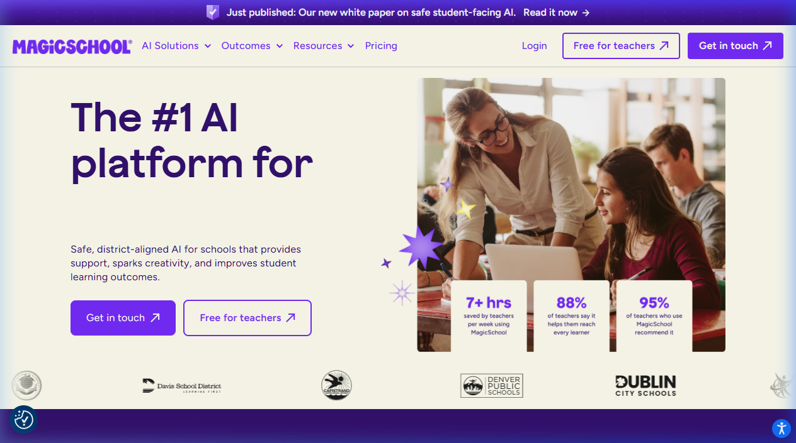
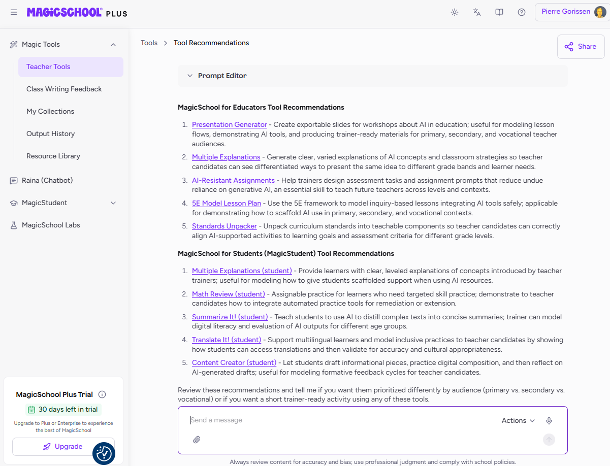

[MagicSchool AI](https://www.magicschool.ai/) is een platform dat speciaal is ontwikkeld **door en voor leraren**. In tegenstelling tot generieke AI-tools als ChatGPT of [Claude](/voorbeelden/claude-ai.qmd), is MagicSchool gebouwd rondom concrete lerarentaken: de interface bestaat uit een bibliotheek van meer dan 60 vooraf gedefinieerde tools, elk gericht op een specifieke taak die leraren dagelijks uitvoeren.

## Welke tools biedt MagicSchool?

### Lesvoorbereiding
- **Lesplannen genereren** op basis van leerjaar, vak, doelen en beschikbare tijd
- **Toetsvragen opstellen**: meerkeuzevragen, open vragen, situatietests
- **Rubrics ontwerpen**: beoordelingscriteria uitschrijven met descriptoren per niveau
- **Differentiatiesuggesties**: hoe dezelfde les aan te passen voor verschillende niveaus of leerbehoeften

### Communicatie
- **Ouderbrieven schrijven**: zet raapachtige aantekeningen om in professionele brieven
- **IEP-doelen formuleren**: ondersteuning bij het opstellen van handelingsplannen
- **E-mails opstellen** voor ouders, leerlingen of collega's

### Lesmateriaal
- **Teksten aanpassen aan leesniveau**: maak een artikel toegankelijk voor jouw specifieke klas
- **Leessuggesties** genereren op basis van thema en niveau
- **Discussievragen** en socratische vragen formuleren

MagicSchool bevat ook **Raina**, een AI-assistent voor leerlingen die vragen stelt in plaats van antwoorden te geven — vergelijkbaar met de Socratische methode.

## Disclaimer

Ik heb MagicSchool zelf nog niet echt gebruikt, wat ik snel kan zien na inloggen is niet persé indrukwekkend en daar zijn vast ook Nederlandse (betaalde) alternatieven voor. De tekst hierboven is dus een algemene, door AI gegenereerde beschrijving. Tips over dit soort platforms in het Nederlands én gebruikservaringen zijn welkom!

