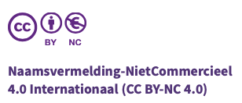

# Realisatie en licentie

Deze module is initieel in 2023 ontwikkeld door [Pierre Gorissen](https://www.ixperium.nl/over-ons/medewerkers/pierre-gorissen/) en in 2024, 2025 en 2026 licht bijgewerkt en voorzien van aanvullende content.
De eerste versie van de module zijn gemaakt in de open source leeromgeving [Xerte](https://xerte.org.uk/index.php/en/). De inhoud van de module is in 2026 geconverteerd naar [Quarto](https://quarto.org/), een open source auteurssysteem met het voordeel dat de bronbestanden ook individueel te delen en te bewerken zijn via github.

## Privacy

Deze module verzamelt op dit moment geen gebruiksinformatie ten behoeve van (anonieme) gebruiksanalyse.

Er wordt echter wel gebruik gemaakt van YouTube filmpjes, zie voor het bijbehorende privacybeleid [deze pagina](https://policies.google.com/privacy?hl=nl).

## Zelf hosten in je leeromgeving

Je kunt een kopie van deze module module downloaden en opnemen in je eigen leeromgeving. De download komt er zo spoedig mogelijk aan.

## Creative Commons Licentie

De inhoud van deze module wordt beschikbaar gesteld onder een Creative Commons licentie:

## Taalgebruik {#sec-taalgebruik}

In het primair onderwijs spreken we van leraren en leerlingen, terwijl in andere sectoren docenten en studenten gebruikelijker zijn. In deze module gebruiken we waar relevant ‘docenten en studenten’, maar dit kan ook leraren en leerlingen betekenen. Belangrijke verschillen tussen onderwijssectoren worden benoemd, maar we focussen op de vele overeenkomsten als startpunt.

In de teksten wordt voor zover mogelijk rekening gehouden met onder andere diversiteit en gender en wordt stereotiepe beeldvorming zo veel mogelijk voorkomen. Het is niet altijd 100% om dat ook voor ingesloten video's te garanderen. Mocht er inhoud in de module voorkomen die hier onvoldoende rekening mee houdt, [laat het ons dan weten](mailto:info@ixperium.nl?subject=Over%20de%20module%20AI%20en%20Onderwijs).