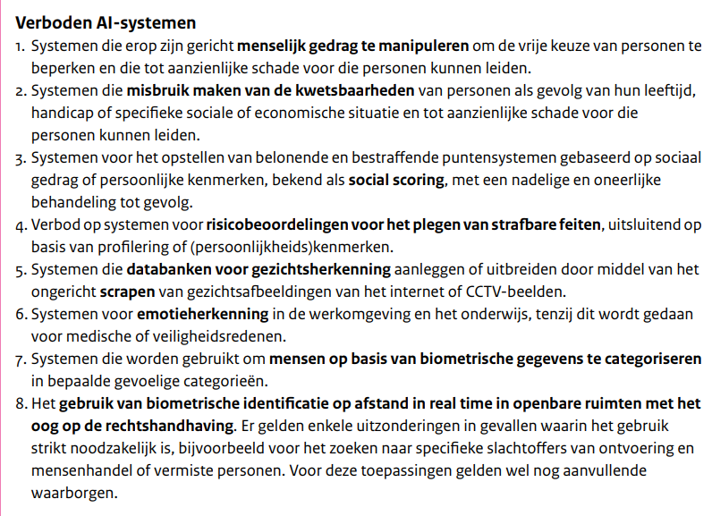

Per [2 februari 2025](https://www.autoriteitpersoonsgegevens.nl/themas/algoritmes-ai/ai-verordening) is de eerste set regels vanuit de Europese AI-verordening (de "AI-Act") van kracht geworden. De volledige verordening is pas vanaf 2 augustus 2027 volledig van kracht.

Sinds februari 2025 is een aantal AI-systemen **verboden**. Ook moeten organisaties die AI gebruiken zorgen dat hun werknemers **AI-geletterd** zijn.

### Verboden AI-systemen
Onderstaande afbeelding geeft een overzicht van de categorieën die onder de verboden vallen:

{.img-fluid .rounded}

Meer informatie is te vinden bij:

- [Rijksoverheid: Gids AI-verordening](https://www.rijksoverheid.nl/documenten/brochures/2024/10/16/gids-ai-verordening)
- [Autoriteit Persoonsgegevens: AI-verordening](https://www.autoriteitspersoonsgegevens.nl/themas/algoritmes-ai/ai-verordening)

## Aan de slag met de AI-act

Npuls heeft een publicatie getiteld [De AI-act en het onderwijs](https://npuls.nl/kennisbank/aan-de-slag-met-de-ai-act) opgesteld waarin ze in het kort beschrijven wat de AI Act voor het onderwijs betekent, welke AI‑tools je wel of niet mag gebruiken in de klas, welke risico’s je moet kennen, en welke stappen je als school moet zetten om verantwoord met AI om te gaan.
