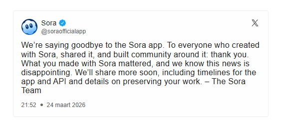

Er zijn weinig dingen in het leven die echt gratis zijn. *"If you are not paying for it, you're not the customer; you're the product being sold"* is een [redelijk deprimerende uitspraak](https://www.quora.com/Who-originally-suggested-that-if-youre-not-paying-for-the-product-you-are-the-product). 

Het doet niet helemaal recht aan bijvoorbeeld open source software, open leermaterialen of open science, maar ook in die gevallen is er altijd iemand die betaald heeft voor de ontwikkeling. Het gebruik van AI is eigenlijk nooit gratis.

### Betalen met je data
Het is een veel bekritiseerde strategie van grote bedrijven zoals Google of Facebook om een dienst gratis aan te bieden, maar dan jouw data te gebruiken om advertenties te verkopen. Voor gratis online AI-diensten geldt: betaal je niet met geld, dan heb je in de regel weinig zeggenschap over wat de aanbieder doet met jouw chatgeschiedenis en bestanden. In een onderwijssetting is dit vaak niet wenselijk.

### Betalen voor premium diensten
Aanbieders zoals OpenAI hebben na de gratis start inmiddels de nodige betaalde diensten toegevoegd. Hoewel dit vaak gepaard gaat met betere privacybescherming, ontstaat er een risico op toename van kansenongelijkheid: de beste tools zijn niet meer voor iedereen toegankelijk.

### Betalen voor de hardware
Open source modellen zoals [Whisper](https://github.com/openai/whisper) kun je zelf draaien, maar dat vereist krachtige hardware (GPU's). De kosten voor dergelijke hardware lopen stevig in de papieren. Ook hier is kansenongelijkheid een risico tussen studenten die deze hardware thuis hebben en studenten die dat niet hebben.

::: {.callout-note collapse="true"}
## Nog meer achtergrondinfo

Betalen voor de hardware is niet alleen een probleem voor gewone consumenten. Ook voor de grote techbedrijven als OpenAI, Google, Microsoft en Meta is dat een uitdaging. Want hardware om AI te trainen is één aspect. 
De hardware om al die miljoenen vragen van gebruikers snel af te handelen, dat is een veel grotere kostenpost. Veel van de hardware daarvoor komt nu nog van NVIDIAIn de video hieronder wordt uitgelegd dat deze grote techbedrijven al lang door hebben dat voor de langere termijn het niet verstandig is om afhankelijk te blijven van één bedrijf. Dan zou NVIDIA immers de prijzen van de hardware kunnen bepalen en daarmee hun winstgevendheid in gevaar brengen. Daarom investeren ze nu massaal in het zelf ontwikkelen van chips.



:::

### Duurzaam gebruik van AI
Het trainen en gebruiken van AI heeft ook een effect op onze omgeving (energieverbruik, waterkoeling van datacenters). Hoewel partijen zoals OpenAI en ABN AMRO spreken over "Groene AI voor duurzaamheid", is AI geen eenvoudige oplossing voor klimaatuitdagingen zonder zelf impact te hebben.


In de video hierboven hoor je Bernhard van Gastel, assistant professor bij de Radboud Universiteit, vertellen over de (ecologische) kosten van AI. 

## En als het geen geld oplevert?

En als het geld geen oplevert, dan kan het zijn dat een app of een toepassing heel snel ook weer verdwijnt. Zoals bijvoorbeeld met de Sora app van OpenAI voor het maken van filmpjes met AI. Daar had het bedrijf in 2025 nog grote plannen mee, er werd o.a. een samenwerking met Disney aangekondigd. Maar in maart 2026 [was het alweer voorbij](https://nos.nl/artikel/2607716-openai-stopt-met-video-generatorapp-sora). De technologie was nog niet zo ver dat het de kosten waard was. En OpenAI maakt weliswaar hoe dan ook nog geen winst, [geld verdienen](https://nos.nl/artikel/2607814-met-grappige-ai-filmpjes-verdient-openai-geen-geld) is ook voor hen belangrijk.