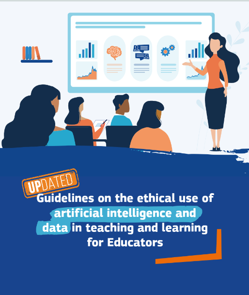

De Europese Commissie heeft de [Ethische richtsnoeren voor het gebruik van Artificiële Intelligentie bij onderwijzen en leren voor onderwijsactoren](https://op.europa.eu/en/publication-detail/-/publication/f692aa0b-17a7-11f1-8870-01aa75ed71a1) opgesteld.

Dit document beschrijft voorbeelden, misvattingen en ethische overwegingen voor AI in het onderwijs. De zeven kernvereisten zijn:

1. **Menselijke agency en menselijk toezicht**
2. **Transparantie**
3. **Diversiteit, non-discriminatie en rechtvaardigheid**
4. **Maatschappelijk en ecologisch welzijn**
5. **Privacy en datagovernance**
6. **Technische robuustheid en veiligheid**
7. **Verantwoording**

{.img-fluid .rounded}

[Download hier het volledige document](https://op.europa.eu/en/publication-detail/-/publication/f692aa0b-17a7-11f1-8870-01aa75ed71a1).

De richtlijnen zijn recent (2026) bijgewerkt en de nieuwe versie is nog niet in het Nederland beschikbaar. 
