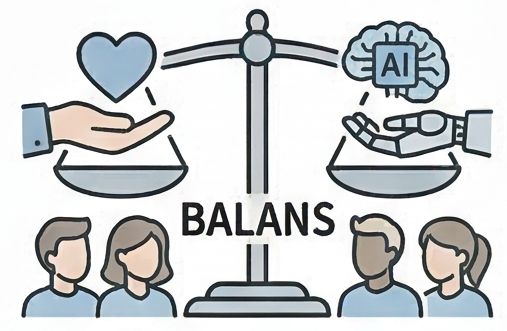

{.lightbox height="200px"}

In dit onderdeel van de module onderzoeken we de relatie tussen de mens en Kunstmatige Intelligentie. We kijken naar de filosofische kant van technologie, de kosten van 'gratis' diensten, ethiek, wetgeving en de risico's van bias in algoritmen.

Klik in de zijbalk op een van de onderwerpen om meer te lezen:

- **[De mens centraal?](./mens-en-technologie.qmd)** — Over de relatie tussen mens en technologie door Peter Paul Verbeek.
- **[Betalen voor AI](./betalen-voor-ai.qmd)** — Waarom AI nooit echt gratis is (data, premium, hardware, duurzaamheid).
- **[Ethiek en Richtlijnen](./ethiek-en-richtlijnen.qmd)** — De ethische richtsnoeren van de EU voor het onderwijs.
- **[De AI-Act](./ai-act.qmd)** — Wat is de nieuwe Europese wetgeving en wat betekent het voor ons?
- **[Coded Bias](./coded-bias.qmd)** — Over de documentaire en de verborgen vooroordelen in AI.
- **[Bias in de praktijk](./bias-praktijkvoorbeelden.qmd)** — Voorbeelden van waar het fout ging, zoals bij antispieksoftware.
- **[Responsible AI](./responsible-ai.qmd)** — Een diepgaande videoserie over verantwoorde AI.
