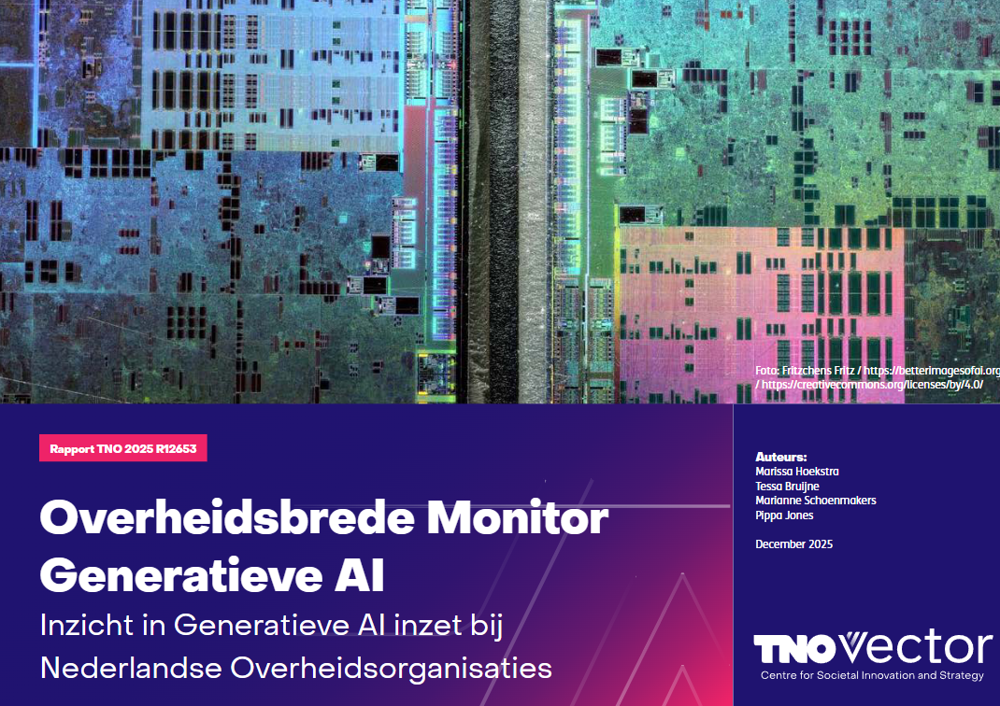

Niet alleen het onderwijs maakt gebruik van AI. Ook de overheid experimenteert met de mogelijkheden van AI. TNO publiceert regelmatig over het gebruik van kunstmatige intelligentie binnen de publieke dienstverlening. 

### Quickscan 2024
TNO publiceerde in 2024 [de derde editie van een Quickscan](https://www.tno.nl/nl/nieuws/2024/06/quickscan-kunstmatige-intelligentie-publieke-dienstverlening-2024/) over het gebruik van kunstmatige intelligentie binnen de publieke dienstverlening. In die editie vind je voorbeelden zoals:

- AI als anonimiseringstool voor documenten die bij de overheid worden opgevraagd;
- Voor het detecteren van illegale fuiken bij visserij inspectie;
- Het beantwoorden van kamervragen

{.img-fluid .rounded}

### Quickscan 2025 - generatieve AI
Vanaf de editie van 2025 richt het TNO-rapport zich specifiek op het gebruik van generatieve AI bij de overheid. Daarbij wordt een stevige toename van toepassingen gesignaleerd, van 8 genAI toepassingen in 2024 naar 81 in 2025. En de toepassingen zijn al vaak onderdeel van de dagelijkse praktijk. Lees hier [het quickscanrapport](https://www.tno.nl/nl/newsroom/2025/12/stijging-gebruik-generatieve-ai-overheid/).

{.img-fluid .rounded}
