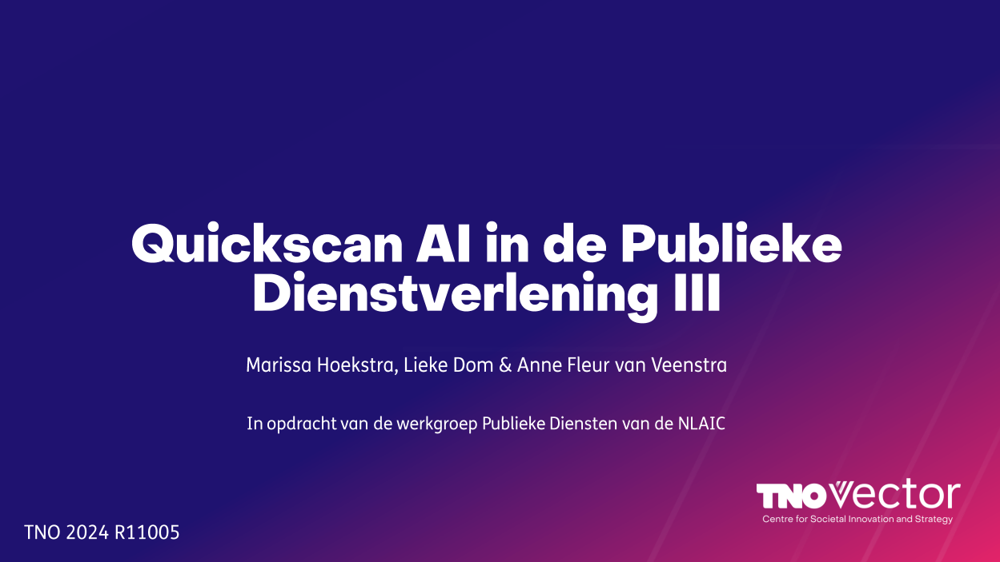

TNO publiceert regelmatig over het gebruik van kunstmatige intelligentie binnen de publieke dienstverlening. 

{.img-fluid .rounded}

### Monitor December 2025
Volgens de meest recente berichten van TNO (december 2025) is er een **significante stijging** in het gebruik van Generatieve AI bij de overheid. Waar voorheen vooral werd geëxperimenteerd, worden tools nu vaker ingezet voor:

- **Anonimiseringstool** voor documenten die bij de overheid worden opgevraagd (Wooo-verzoeken).
- **Detectie van illegale activiteiten** zoals illegale fuiken bij de visserij-inspectie.
- **Ondersteuning bij het beantwoorden van Kamervragen**.

[Lees hier meer over de stijging in het gebruik van generatieve AI bij de overheid](https://www.tno.nl/nl/newsroom/2025/12/stijging-gebruik-generatieve-ai-overheid/).

### TNO Unboxed: Nederlands Taalmodel
Bij TNO Unboxed kun je meer leren over de inzet van het Nederlands Taalmodel dat in ontwikkeling is.


