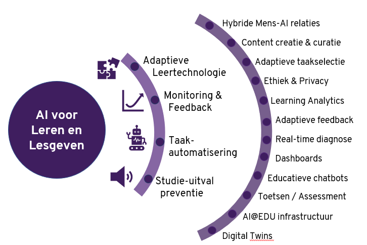

Inleidende video over het onderwerp Data ondersteund onderwijs uit 2022 (pre-ChatGPT). Doelgroep was leidinggevenden in het onderwijs en de video geeft een overzicht van de relatie tussen data-ondersteund onderwijs, studiedata, learning analytics en kunstmatige intelligentie (AI).



Items die je kunt bekijken:

- [Item op nos.nl over het boek Homo Deus van Yuval Noah Harari](https://nos.nl/nieuwsuur/artikel/2170543-homo-deus-na-god-en-de-mens-bepalen-algoritmen-straks-alles)
- [Aflevering van VPRO Tegenlicht over het boek Frictie van Miriam Rasch](https://www.npostart.nl/vpro-tegenlicht/24-01-2021/VPWON_1322203)
- [Website van de NL AI Coalitie](https://nlaic.com/)

{.img-fluid .rounded}

