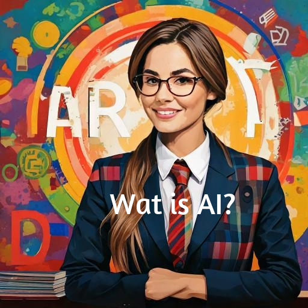

Welkom bij de inleiding van de module MOVEL AI. In dit gedeelte leggen we de basis voor je begrip van Kunstmatige Intelligentie en de impact ervan op het onderwijs en de samenleving.

Klik in de zijbalk op een van de onderwerpen om meer te lezen:

- **[Wat is AI?](./wat-is-ai.qmd)** — De basisdefinitie en het lerend vermogen.
- **[AI in het Onderwijs](./ai-onderwijs-2025.qmd)** — Ontwikkelingen en video's specifiek voor docenten.
- **[AI bij de Overheid](./ai-overheid.qmd)** — Hoe de publieke sector AI inzet (Monitor 2025).
- **[NOS op 3 & NOS Stories](./nos-op-3.qmd)** — Actuele uitlegvideo's.
- **[Lubach over AI](./lubach.qmd)** — Een kritische en humoristische blik op fake news.
- **[Het Jaws Effect](./jaws-effect.qmd)** — Over beeldvorming en frictie.
- **[Creativiteit](./creativiteit.qmd)** — Is AI een bedreiging of verrijking?

{.img-fluid .rounded}
