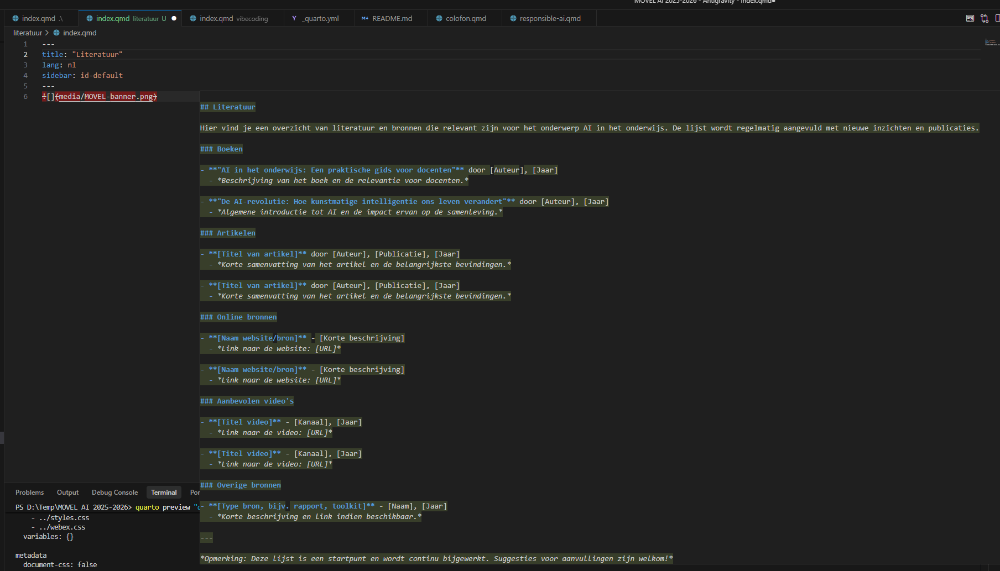
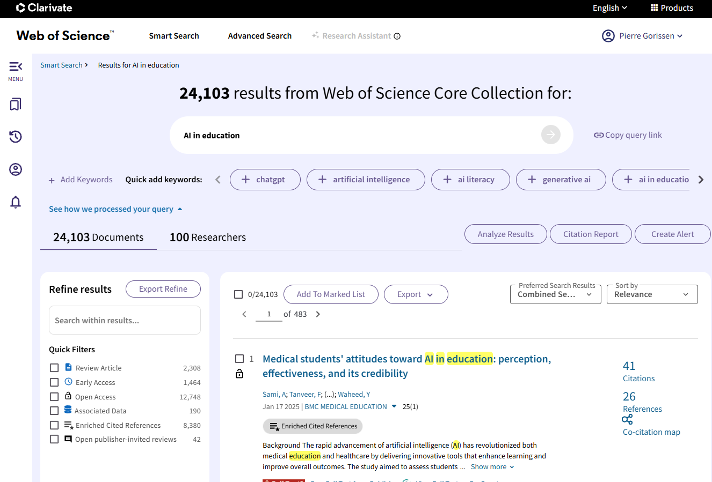
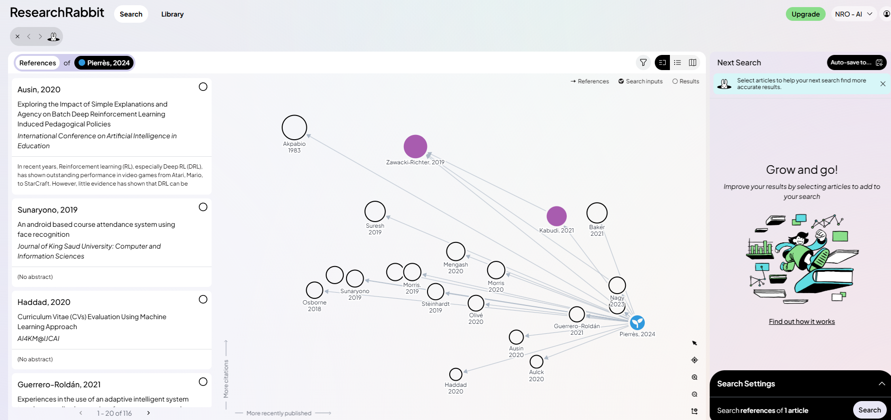

Bij het aanmaken van de lege pagina voor dit onderdeel, schoot [Antigravity](/voorbeelden/antigravity.qmd) meteen in de meedenkstand.

Maar, hoewel deze pagina inderdaad een aantal suggesties bevat, ga ik hier geen "complete" literatuurlijst aanbieden. Niet alleen is dat onmogelijk, het is ook juist de bedoeling dat je als MOVEL-student zelf op onderzoek uitgaat. Je moet als MOVEL-student laten zien dat je als docent niet alleen op gevoel en je onderbuikgevoel je keuzes maakt, maar dat je ook op basis van onderzoek en bewijs je keuzes maakt. 

Wel krijg je hier een aantal handvatten en suggesties om je op weg te helpen. 

## Boeken
Boeken (fysiek, op papier) zijn een prima bron van informatie. Zeker voor onderwerpen die langere tijd onveranderd blijven. De ontwikkelingen rond AI zijn dat niet. Dat maakt dat boeken over AI snel verouderd zijn. Boeken over specifieke toepassingen al helemaal.
Daar komt bij dat het gebruik van bijvoorbeeld generatieve AI in het onderwijs nog relatief nieuw is, dus boeken daarover zullen altijd geschreven zijn op basis van het perspectief van dat moment. 
Als je op zoek bent naar een lijstje boeken over AI en onderwijs, dan kun je o.a. [hier kijken](https://libguides.bibliotheek.han.nl/DDV/AI)

## Rapporten en magazines
Er zijn de nodige rapporten en andere (digitale) publicaties over AI (in het onderwijs). Voor dit soort publicaties geldt dat je ze eigenlijk net zo moet behandelen als alle andere informatie op internet. Je moet je afvragen: wie heeft dit gemaakt? Wat is het doel van deze publicatie? Is het betrouwbaar? Enzovoort. Dat een publicatie mooi opgemaakt is, betekent niet dat de inhoud klopt. 

In deze module kom je op een aantal plekken verwijzingen tegen naar zulke rapporten, zoals bij de informatie over [NOLAI](/ai-in-het-onderwijs/nolai.qmd), [Kennisnet](/ai-in-het-onderwijs/kennisnet.qmd) en [AI-Teach](/ai-in-het-onderwijs/ai-teach.qmd).

## Wetenschappelijke publicaties
Voor veel MOVEL-studenten is de stap naar het gebruik van wetenschappelijke publicaties een lastige. Dat zijn teksten die geschreven zijn door onderzoekers voor onderzoeker. Meestal in het Engels, vaak met een heel eigen vocabulaire en een heel eigen manier van argumenteren.

Daar komt voor AI in het onderwijs bij dat het aantal publicaties dat beschikbaar is, enorm is. Zelfs als je niet in [Google Scholar zoekt](https://scholar.google.nl/scholar?hl=nl&as_sdt=0%2C5&q=ai+in+onderwijs&btnG=), maar bijvoorbeeld in [Web of Science](https://clarivate.com/academia-government/scientific-and-academic-research/research-discovery-and-referencing/web-of-science/) zoals in de screenshot hieronder, dan kom je al gauw duizenden publicaties tegen, waarvan een groot deel (dik 10.000) alleen al uit 2025.

Ook bij wetenschappelijk publicaties geldt: je moet je afvragen: wie heeft dit gemaakt? Wat is het doel van deze publicatie? Op welke context (onderwijssector) of groep studenten heeft het onderzoek betrekking? Het is niet zo dat elke publicatie zomaar "bewijs" levert voor jouw specifieke situatie.
Een speciaal soort publicatie is de **review** of **systematic review**. Hierbij worden meerdere publicaties over een bepaald onderwerp verzameld en geanalyseerd.

Bijvoorbeeld:

Pierrès, O., Christen, M., Schmitt‑Koopmann, F., & Darvishy, A. (2024). *Could the use of AI in higher education hinder students with disabilities? A scoping review.* IEEE Access. (https://doi.org/10.1109/ACCESS.2024.3365368) 

In deze review wordt gekeken naar de mogelijke nadelen van AI voor studenten met een beperking. Niet op basis van één experiment, maar op basis van een analyse van meerdere experimenten en publicaties.

Of:

Gao, H., & Tan, Y. (2025). *AI Differences in Vocational and Undergraduate Differential Applications of Artificial Intelligence in Undergraduate and Vocational Higher Education: A Systematic Review.* Higher Education Studies, 15(4), 398–408. (https://doi.org/10.5539/hes.v15n4p398) 

In deze review wordt gekeken naar de verschillen in het gebruik van AI door studenten in het hoger onderwijs en het beroepsonderwijs. 

Dit kunnen dus startpunten zijn om je te verdiepen in een onderwerp. Maar ook daarvan heb je er inmiddels voor AI al heel veel.

### Zotero
[Zotero](https://www.zotero.org/) is een gratis tool voor het beheren van je literatuur. Je kunt er je eigen literatuur in opslaan, organiseren en delen. Ook kun je er je eigen literatuur in opslaan, organiseren en delen. En je kunt er je eigen literatuur in opslaan, organiseren en delen.
Heel erg handig om literatuur in te organiseren omdat je vanuit Zotero ook gemakkelijk correcte literatuurverwijzingen kunt opnemen in Word, dus als je je reflectieverslag schrijft voor de CGI van MOVEL, dan scheelt het gebruik van Zotero je een hoop werk.

### Research Rabbit
[Research Rabbit](https://www.researchrabbit.ai/) is een gratis tool voor het vinden van andere wetenschappelijke publicaties. 

Je kunt beginnen met een paar publicaties die je al kent en Research Rabbit zoekt dan naar publicaties die daar naar verwijzen, van waaruit verwezen word of die thematisch lijken op het artikel dat je toevoegt. Hierboven in de afbeelding zie je het resultaat voor de review van Pierrès et al. (2024). Research Rabbit heeft het moeilijk met de enorme stroom artikelen die er over AI verschijnen. De review over Gao & Tan (2025) levert bijvoorbeeld niets op. Die kent de database nog niet.

Mocht je je afvragen waarom de tool deze naam heeft: het is een verwijzing naar het idee dat je met een paar publicaties een heel netwerk van publicaties kunt ontdekken, in het Engels wordt dat "going down the rabbit hole" genoemd.

## YouTube
Aan de volledig andere kant van het spectrum vind je YouTube. Hier vind je heel veel video's over AI en toepassingen ervan. Over AI in het onderwijs is het aanbod wat magerder. Je vindt een aantal suggesties van kanalen die zich richten op AI en onderwijs op de pagina over [AI in het onderwijs](./ai-in-het-onderwijs/index.qmd).

## Films en documentaires
Films zijn een prima middel om je te verdiepen in een onderwerp. Daarom is daar [een hele pagina over opgenomen](/ai-in-de-film/) in deze module. Maar dan vooral voor meningsvorming en discussie. Een documentaire moet je weer net zo behandelen als alle andere informatie: wie heeft dit gemaakt? Wat is het doel van deze publicatie? Is het betrouwbaar? Enzovoort.
Ook bij een documentaire als bv [Coded Bias](/de-mens-en-ai/coded-bias.qmd) gelden die vragen. En ja, ook bij de clips van [/inleiding/nos-op-3.qmd] zijn die vragen relevant. Nee, niet omdat de *mainstream* media per definitie onbetrouwbaar zijn, of ons willen misleiden. Maar wel omdat ook zij een bepaalde invalshoek hebben, een bepaalde doelgroep en een bepaalde context.

## Podcasts
Audiopodcasts waren populair begin deze eeuw. Nu zijn ze weer helemaal terug. En ook over AI en onderwijs zijn er inmiddels diverse podcasts te vinden. Had ik al gezegd dat voor dit soort bronnen geldt dat je je af moet vragen: wie heeft dit gemaakt? Wat is het doel van deze publicatie? Is het betrouwbaar? Enzovoort. Ja, dat had ik. Maar het kan niet vaak genoeg herhaald worden.

## Wetenschappelijke discussies
Onenigheid is prima. Discussie kan een heel constructieve werkvorm zijn. Als alle onderzoekers het met elkaar eens zouden zijn en alle vragen beantwoord zouden zijn, dan zouden we klaar zijn. Van jou als MOVEL-student wordt verwacht dat je je in dat gesprek (klinkt vriendelijker) kunt mengen. Met een onderbouwde mening en inzichten. De bronnen die hierboven genoemd zijn, helpen je daarbij.

:::{.callout-note}
## Is de aarde plat?

Onderzoekers houden ervan om met elkaar in discussie te gaan. Elk onderzoek levert vaak meer nieuwe vragen dan antwoorden op. Dat is prima, want dat is hoe wetenschap vooruitgaat. Het betekent niet dat je onderzoek kunt afdoen als een mening. En discussie moet natuurlijk ook wel een doel hebben. Een discussie over de vraag of de aarde plat is, is bijvoorbeeld niet zo zinvol. Over de vraag of AI in het onderwijs goed is of niet, kan discussie heel zinvol zijn. Als het tenminste gaat over de vraag onder welke voorwaarden, in welke context en voor welke doelgroep (in een bepaalde context).  
:::

## Evidence based of informed of geïnformeerd handelen?
De Onderwijsraad heeft [recent een advies uitgebracht](https://www.onderwijsraad.nl/documenten/2026/03/19/leren-van-onderzoek) aan de overheid over het al dan niet sturen op evidence-informed werken in de onderwijspraktijk. Daarbij omschrijven ze de evidence-based practice als gericht op *effectonderzoek* als belangrijkste bron van kennis, met een sterke nadruk op bewezen effectieve methodes (*Randomized Controlled Trials*, RCT’s, causale effecten), ontstaan vanuit de medische wereld.
De Onderwijsraad pleit voor een meer genuanceerde benadering, die van het *evidence-informed* werken. Daarbij wordt niet alleen gekeken naar effectonderzoek, maar ook naar andere vormen van kennis, zoals praktijkkennis, ervaringskennis en contextkennis. Zij stellen dat, hoewel in beleid en kamerstukken vaak het begrip evidence-informed wordt gebruikt, het in de praktijk vaak neerkomt op evidence-based werken. En dat is volgens de Onderwijsraad niet wenselijk. Niet alleen waarschuwen ze voor deze ontwikkeling, ze stellen ook voor om in plaats daarvan de term *geïnformeerd handelen* te gebruiken: *Handelen op basis van een scala aan bronnen, geïnformeerd over verschillende handelingsopties en op basis van afwegingen over de eigen praktijk.*

Binnen iXperium wordt gesproken over evidence-informed werken. Omdat binnen AI in het onderwijs of technologiegebruik in het onderwijs, het zelden voor zal komen dat er een RCT is gedaan naar de effectiviteit van een bepaalde toepassing in een specifieke context. 

