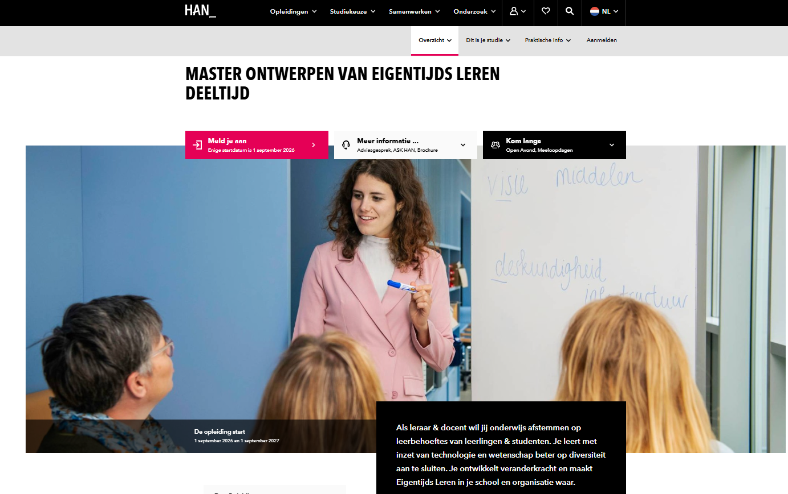

## Doelgroep
Doelgroep voor dit materiaal zijn docenten ([leraren](/colofon.qmd#sec-taalgebruik)), studenten van de lerarenopleidingen en lerarenopleiders. Het materiaal wordt ingezet bij een masteropleiding, maar is zeker niet zo complex dat je die masteropleiding nodig hebt om het te kunnen begrijpen. De opzet is thematisch waarbij je redelijk vrij door de menu-onderdelen kunt springen.

## Inhoud

-   Een logisch startpunt is de [Inleiding](/inleiding/), met een samenvattende video van 20 minuten over het onderwerp en verwijzingen naar andere plekken waar je nog meer over AI op een inleidend niveau kunt leren. 
-   Via de optie [AI Geletterdheid](/ai-geletterdheid/) kun je meer te weten komen over wat AI van docenten, studenten en leidinggevenden vraagt én verwijzingen vinden naar plekken waar je je eigen AI-geletterdheid kunt verhogen.
-   Het onderdeel [Voorbeelden](/voorbeelden/) bevat door de jaren heen groeiende verzameling van voorbeelden van AI die je nu al kunt gebruiken. Een lijst die per definitie niet compleet is, omdat de ontwikkelingen op dit moment zo snel gaan dat elk lijstje alweer achterhaald is zodra deze online verschijnt. Ook de beschrijvingen van de tools die hier nu genoemd worden, zijn sinds het verschijnen op deze lijst alweer een paar keer aangepast. Zie het als een startpunt om zelf op onderzoek uit te gaan en [te experimenteren](/ai-geletterdheid/experimenteren.qmd).
-   Het onderwerp [AI in het onderwijs](/ai-in-het-onderwijs/) was bij de eerste iteratie van deze module nog een moeizame om te vullen. Er werd nog weinig met AI in het onderwijs gedaan en er waren weinig voorbeelden van specifiek voor het onderwijs ontwikkelde systemen. Inmiddels is de nadruk in dat onderdeel aan het verschuiven naar het inzetten van AI bij het herontwerp van je onderwijs. Aangevuld met voorbeelden van specifiek voor het onderwijs ontwikkelde systemen.
-   Is [vibecoding](/vibecoding/) een essentiële competentie voor docenten of alleen iets voor techneuten? Dat is een vraag die je jezelf kunt stellen bij het lezen van dit onderdeel. Nu als apart onderdeel in het zijmenu, volgend jaar mogelijk zo vanzelfsprekend dat het onderdeel wordt van AI-geletterdheid.
-   Het onderdeel [Literatuur](/literatuur/) is toegevoegd omdat het belangrijk is om je eigen keuzes te kunnen onderbouwen. Verwacht hier geen lange lijsten bronnen.
-   Het onderwerp Ethiek en AI, Responsible AI of zoals het nu in het menu heet [De mens en AI](/de-mens-en-ai/) is op zichzelf al voldoende om een hele module voor te ontwikkelen. Je vindt hier een aanzet tot nadenken over.
-   Het onderwerp [AI in de film](/ai-in-de-film/) is opgenomen omdat films een goede manier kunnen zijn om een woordenschat op te bouwen die helpt bij het beschrijven van wat we wél of juist niet willen dat AI is, doet of kan.
-   De [Test Jezelf](/toets-jezelf.qmd) sectie is een vriendelijke zelftest. Zeker geen complete "als je hier een 10 voor haalt dan ben je klaar" test.
-   De [Colofonpagina](/colofon.qmd) legt uit dat je de materialen mag hergebruiken, je kunt er zelfs deze hele module downloaden om zelf te gebruiken.

## HAN Master Ontwerpen Van Eigentijds Leren

 Dit materiaal is onderdeel van het lesmateriaal ontwikkeld voor de HAN Master Ontwerpen Van Eigentijds Leren ([MOVEL](https://www.han.nl/opleidingen/master/ontwerpen-van-eigentijds-leren/deeltijd/)). 

Kunstmatige intelligentie (AI) was al vanaf de start van de masteropleiding een onderwerp dat aan de orde kwam. Maar het was lange tijd een abstract begrip voor leraren. Met de komst van [ChatGPT](http://openai.com/blog/chatgpt/) eind 2022 kwam daar verandering in, en twee jaar later is het AI-aanbod overweldigend. Ook binnen MOVEL gaan we hiermee aan de slag. Niet om deelnemers tot ChatGPT-experts te maken, maar om hen te helpen AI in het onderwijs te duiden, collega’s te ondersteunen en deze technologie doordacht te integreren. Deze online module verzamelt relevante achtergrondmaterialen op één plek. Maar het is zeker ook niet de enige activiteit en bron voor studenten binnen MOVEL op dit vlak. De andere zijn niet allemaal open online beschikbaar voor studenten buiten de HAN of MOVEL.

### Voor MOVEL-studenten

Niets van de inhoud van deze module komt terug in de voortgangstoets. Het is facultatief materiaal. Doe er je voordeel mee. Bijvoorbeeld ter voorbereiding van je CGI voor Leren en lesgeven met ict!

### Voor anderen

Zoals je op de [Colofonpagina](/colofon.qmd) kunt lezen, wordt deze module gedeeld onder een Creative Commons licentie. Op de colofonpagina kun je een compleet exemplaar van de module downloaden en dan zelf bijvoorbeeld in een eigen leeromgeving uploaden. Dat kan dus betekenen dat je deze module ziet in een heel andere context dan MOVEL of de HAN. Leuk! [Laat het ons vooral weten](mailto:info@ixperium.nl?subject=Over%20de%20module%20AI%20en%20onderwijs) en vertel ons in welke context je de materialen gebruikt en of ze je helpen.

