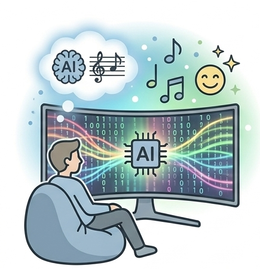
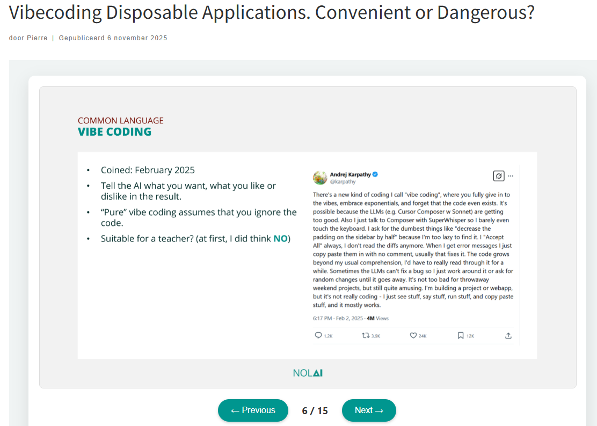
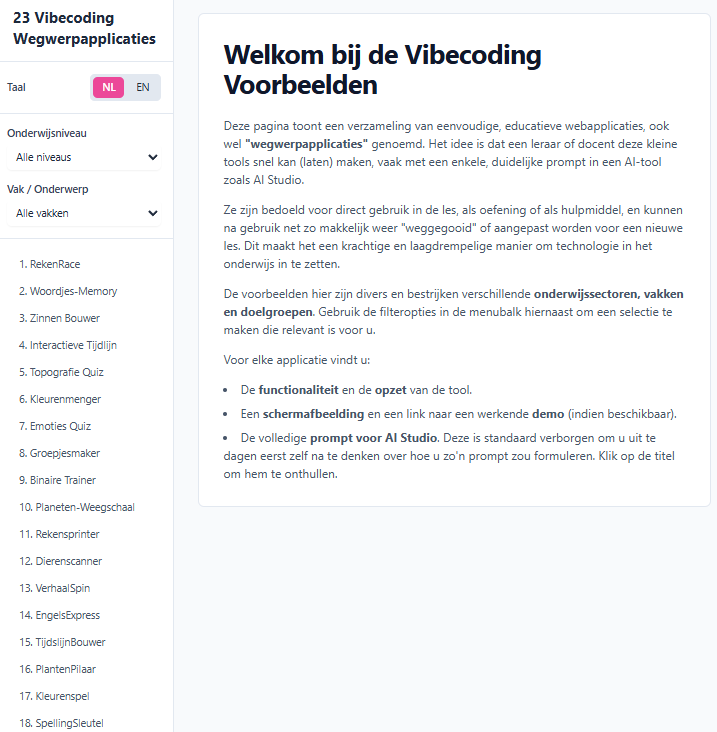
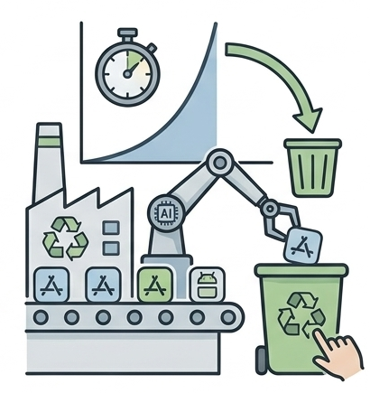

*Deze pagina leest een beetje als een blogpost, minder dan een formele onderwijskundige tekst. Het is een gevolg van het onderwerp*

Er was heel wat voor te zeggen geweest om deze pagina niet als een aparte optie in de navigatie te zetten. En in plaats daarvan onder te brengen bij [ai-geletterdheid](/ai-geletterdheid/), of bij [voorbeelden](/voorbeelden/) van AI, of [AI in het onderwijs](/ai-in-het-onderwijs/). Ik denk dat als ik het aan Gemini 3 Flash hier in [Antigravity](/voorbeelden/antigravity.qmd) had gevraagd, doe zou hebben voorgesteld om het zeker niet apart op te nemen. Omdat het veel te technisch is. Maar dat is uiteindelijk de vraag.

## Een antwoord

In [de presentatie](https://ictoblog.nl/2025/11/06/vibecoding-disposable-applications-convenient-or-dangerous) die ik daarover bij NOLAI verzorgde in november 2025, leg ik uit dat ik eerst zelf ook dacht dat het niks voor een leraar was. In de screenshot hierboven zie je dat ik verwijs naar [een Tweet](https://x.com/karpathy/status/1886192184808149383) (=bericht op X) van februari 2025 waarin Andrej Karpathy, een van de opdrichters van OpenAI, enthousiast vertelt over 'vibecode' en 'disposable applications'. 

Vrij vertaald (door Gemini) zegt Andrej:
*"Er is een nieuwe manier van programmeren die ik **'vibecoding'** noem: je geeft je volledig over aan de 'vibes', omarmt de exponentiële groei en vergeet simpelweg dat de code überhaupt bestaat. Het is mogelijk omdat LLM's (zoals Cursor Composer met Sonnet) bizar goed worden. Bovendien praat ik gewoon tegen Composer via SuperWhisper, waardoor ik mijn toetsenbord nauwelijks nog aanraak.
Ik vraag om de meest onbenullige dingen, zoals 'halveer de padding van de zijbalk', simpelweg omdat ik te lui ben om het zelf op te zoeken. Ik klik altijd op 'Accept All'; ik lees de 'diffs' (wijzigingen) niet eens meer. Als ik foutmeldingen krijg, kopieer en plak ik ze gewoon zonder commentaar terug, en meestal lost dat het wel op.
De code groeit mijn gebruikelijke bevattingsvermogen te boven; ik zou het echt een tijd lang grondig moeten bestuderen om het nog te begrijpen. Soms kan de LLM een bug niet oplossen, dus dan bouw ik er gewoon omheen of vraag ik om willekeurige aanpassingen totdat de fout verdwijnt. Voor **wegwerpprojecten** in het weekend is het prima te doen, en eigenlijk best vermakelijk. Ik bouw wel een project of web-app, maar het is niet echt meer programmeren — ik zie dingen, roep dingen, draai dingen en kopieer-plak wat, en meestal werkt het gewoon."*

## Eerste ervaringen
Mijn eigen eerste ervaringen met vibecoding ontstonden uit een behoefte. Ik was in Praag geweest bij een school die een YouTube-video online hadden staan die ik wilde begrijpen. maar hij was in het Tsjechisch, en ze hadden de vertaalopties van YouTube uit staan.
Het uitgebreide verhaal kun je [hier lezen](https://ictoblog.nl/2025/05/18/voorbeelden-van-gebruik-digitale-hulpmiddelen-op-een-tsjechische-basisschool) en het resultaat was een eerste webpagina, gemaakt door AI-studio, die een probleem oplostte dat ik anders niet opgelost had gekregen.

Er volgende meer experimenten in 2025, die ik ook deelde via een [overzichtspagina](https://ictoblog.com/html/) die uiteraard ook met vibecoding tot stand kwam.
In juli [schreef ik er nog eens over](https://ictoblog.nl/2025/07/14/weefgetouw-digitale-geletterdheidgeletterdheid) en tegen de tijd dat het [september was](https://ictoblog.nl/2025/09/16/is-vibecoding-de-nieuwe-pritt-stift-van-de-leraar-of-is-het-computational-thinking-3-0) vergeleek ik het met een Pritt Stift voor de leraar. 

## Alle docenten programmeurs?
Nee, nee, zeker niet. Tenminste, dat hangt een beetje af van hoe je 'programmeren' definieert. Het maken van deze online module noem ik ook geen programmeren. Ja, ik heb Antigravity gebruikt, en Quarto, het geheel wordt beheerd via Github. Dus er komt wel wat technische kennis bij kijken.

En bij vibcodende docenten heb ik het niet over docenten die op die manier een hele leeromgeving voor de school aan het realiseren zijn. Dat is ook niet waar Andrej het over had. Dit zijn de lesvoorbereidingen die een docent op zaterdagochtend in elkaar zet. Voorheen met schaar en Pritt Stift, toen met Word en PowerPoint, en nu met AI.

Voor de sessie bij NOLAI in november heb ik een pagina met [23 single prompt voorbeelden](https://ictoblog.com/html/Vibecoding/) gemaakt. In het Nederlands en het Engels, met een beschrijving, een screenshot, een live (werkende) demo en de prompt die ik gebruikte. Met selectiemogelijkheid om te kiezen tussen Engels en Nederlands. En filters voor onderwijsniveau (NOLAI richt zich op funderend onderwijs, dus geen mbo/hbo voorbeelden op die pagina).
Dat had ik nooit voor elkaar gekregen zónder dat ik ook vibecoding gebruikt had bij het samenstellen van die pagina en die voorbeelden. En dat is nu precies het punt dat ik wil maken. 

## Allemaal betalen voor Claude Code?
Als je [op YouTube zoekt naar vibecoding](https://www.youtube.com/results?search_query=vibe+coding) dan zie je dat het vooral gaat over het gebruik van AI-tools om code te genereren. En dan kom je al snel uit bij betaalde tools zoals [Claude Code](/voorbeelden/claude-code.qmd).

Ook dat is dus niet de bedoeling. Met de gratis opties van [AI-studio](/voorbeelden/ai-studio.qmd) kun je prima vibecoden. En met [Antigravity](/voorbeelden/antigravity.qmd) ook. 
Maar, zo hoor ik je nu denken: dat zijn toch tools van Google en die gebruiken mijn data om hun modellen te traine? En ja, dat klopt. Daarom is het goed om een paar spelregels te hanteren.

:::{.callout-tip}
## Vibecoding spelregels van Pierre
- Alle "normale" regels ronde generatieve AI gelden ook tijdens het vibecoden: geen persoonlijke data, persoonsgegevens of bedrijfsdata in de tools stoppen.
- Het resultaat bestaat uit 1 HTML pagina (met CSS, JavaScript en evt. JSON voor opslag)
- Geen AI-functionaliteit in de pagina zelf (dus geen API calls naar OpenAI etc.)
- Geen permanente dataopslag op de server of in de cloud.
:::

Als je je aan deze regels houdt én er voor zorgt dat je geen apps aan het ontwikkelen bent waar je over 2-3 maanden nog steeds onderhoud op zou moeten plegen, dan is het gebruik van dit soort tools prima te verantwoorden. Alles wat complexer is dan wat je hier meer kunt realiseren, of wat toegang tot data nodig heeft die je niet zomaar met Google zou mogen delen, moet je ook simpelweg niet willen gaan vibecoden. Dan moet je echt gaan programmeren. En dat is een heel ander verhaal.

## Wegwerpapplicaties zijn niet duurzaam

Het is een mooi bezwaar tegen wegwerpapplicaties. Maar het is niet het hele verhaal. Een wegwerpapplicatie wordt zo genoemd omdat je er geen onderhoud aan pleegt. Traditioneel zijn applicaties zaken die veel ontwikkeltijd gekost hebben en waar dus ook veel monetaire waarden aan hangen. Dat is niet het geval voor een wegwerpapplicatie. Dat betekent dus dat die in de productie wint van de traditionele applicatie. Natuurlijk, als je géén applicatie nodig hebt en niet bouwt, dan is dat het meest duurzaam. Maar een app bouwen, hosten en dan jarenlang onderhouden, kost uiteindelijk veel meer energie en grondstoffen dan een wegwerpapplicatie. En dat is de vergelijking die je moet maken. 
Dus als je dan toch een jaarlijkse digitale schoonmaak organiseert binnen je school, kun je ook meteen de wegwerpapplicaties die je het laatste halfjaar niet meer gebruikt hebt, opruimen.
