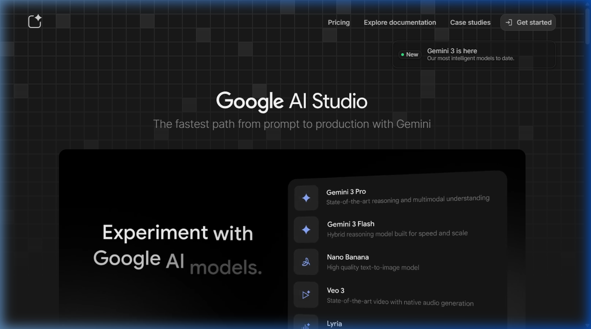

{.img-fluid .rounded}

[Google AI Studio](https://aistudio.google.com/) is een ontwikkelplatform van Google. Een tijd lang was het de enige gratis optie als je aan [vibecoding](/vibecoding/) wilde doen. Tegenwoordig kan elke chatbot wel via de **canvas** optie ook websites en compacte apps bouwen. Desondanks blijft het een mooie playground.

Daarnaast heeft Google AI Studio nog steeds als voordeel ten opzichte van andere omgevingen dat de 'contextomvang' (de hoeveel tokens die beschikbaar zijn in een gesprek), zeker voor een gratis omgeving erg groot is (1 miljoen tokens). Ook ben je bij AI-studio in staat om bv een YouTube-video te linken waarbij het taalmodel dan de inhoud van die video in de context opneemt. Dat maakt het bv mogelijk om ook inhoudelijke vragen te stellen over de video. Dat kun je ook in NotebookLM, maar als je bv een webspagina wilt laten genereren met daarin automatisch gegenereerde navigatie binnen de video, dan is dit heel handig.

::: {.callout-important}
Als Google dit soort omgevingen in de lucht brengt, dan komt het heel vaak voor dat ze deze ook weer offline halen. Dus ga er geen meerjarige lesprogramma's op bouwen, of je bedrijf op starten. Maar om mee te experimenteren zolang het beschikbaar is, is het heel mooi.
:::

Google AI Studio heeft ook een optie waarbij je de AI mee kunt laten kijken naar alles wat je doet op je computer. Dat lijkt eng, maar je kunt het aan of uitzetten. Heel handig als je bijvoorbeeld iets in Excel moet doen en niet precies weet hoe dat moet.