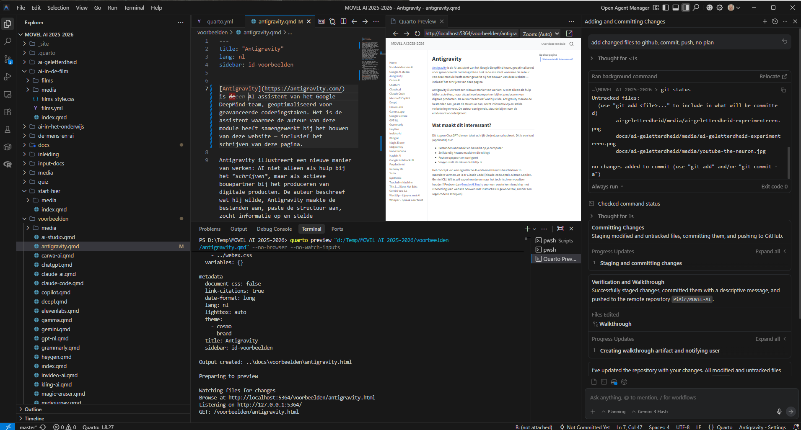

[Antigravity](https://antigravity.com/) is de AI-assistent van het Google DeepMind-team, geoptimaliseerd voor geavanceerde coderingstaken. Het is de assistent waarmee ook delen van deze module zijn gemaakt, inclusief het schrijven van deze pagina.

Nou klinkt dat wellicht spannender dan dat het is. Het komt voor een groot deel omdat [Quarto](https://quarto.org/) ook vanuit Anitgravity te gebruiken is en Antigravity zelf een 'fork' (kopie) is van [VS Code](https://code.visualstudio.com/). Dat maakt het een practische omgeving om met de bestanden van de module te werken in combinatie met een AI-assistent. Die ook weet wat hij moet doen als je gewoon zegt "verzamel alle nieuwe en gewijzigde bestanden en update de git-repository" of als je vraagt om een screenshot te maken van de huidige pagina, die op te slaan in de mediamap en in de pagina in te voegen.

## Zelf proberen?

Het concept van een zo'n agentische AI-codeerassistent is beschikbaar in meerdere vormen, zo is er [Claude Code](claude-code.qmd), [GitHub Copilot](https://github.com/copilot), [Gemini CLI](https://geminicli.com/) (sorry, niet van alle tools is een subpagina beschikbaar in de module). Wil je zelf experimenteren met vibecoden maar het technisch eenvoudiger houden? Probeer dan [Google AI Studio](ai-studio.qmd) voor een eerste kennismaking met vibecoding (een website bouwen met instructies in gewone taal, zonder een regel code te schrijven). 