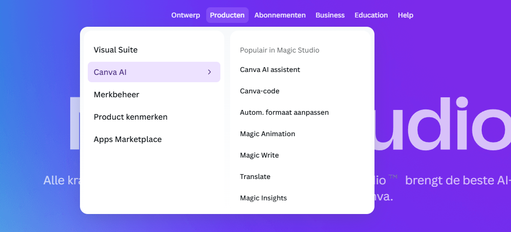

{.img-fluid .rounded}

[Canva](https://www.canva.com/) is al jaren een van de populairste grafische tools binnen het onderwijs: eenvoudig prachtige posters, flyers, presentaties en social media-posts ontwerpen in de browser, zonder grafische opleiding. Inmiddels zit AI diep verweven in Canva's functies.

## Welke AI-functies heeft Canva?

- **Tekst schrijven** — tekst genereren of herschrijven binnen je ontwerp (bijschriften, titels, structuur)
- **Vertaaltool** — vertaal je ontwerp naar een andere taal terwijl de opmaak intact blijft
- **Magic Animation** — animeer een statisch ontwerp automatisch
- **Magic Resize** — pas de grootte van je ontwerp automatisch aan
- **Code Generator** — genereer code voor websites en apps
- **Canva AI Assistant** — AI-assistent die je helpt bij het ontwerpen van afbeeldingen

De gratis Canva-versie bevat al AI-functies. Canva Pro geeft toegang tot alle AI-tools, meer sjablonen en premium afbeeldingen. 

## Ideeën voor educatieve inzet

- Studenten laten samenwerken aan een gezamenlijk ontwerp (Canva ondersteunt samenwerking)
- Lesmateriaal, infographics of posters ontwerpen
- Zoekopdracht als leesopdracht: ontwerp een infographic over… (begrip verwerken door te visualiseren)
- Discussie: welke rol speelt AI bij het ontwerpen? Wat is nog jouw eigen ontwerp als AI het genereert?
