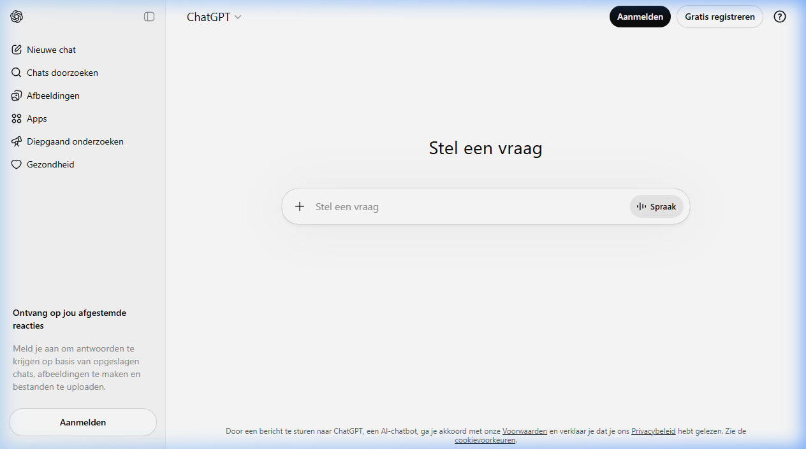

{.img-fluid .rounded}

[ChatGPT](https://chat.openai.com/) van OpenAI is de tool die het grote publiek kennis liet maken met generatieve AI. Eind 2022 verscheen het als gratis dienst en binnen twee maanden had het 100 miljoen gebruikers — sneller dan welke andere consumentendienst in de geschiedenis.



## Van tekst naar alles

ChatGPT begon als een tekstchatbot, maar is inmiddels een compleet platform geworden:

- **Tekstgeneratie**: schrijven, samenvatten, editten, vertalen, redeneren
- **Code schrijven en debuggen** in vrijwel elke programmeertaal
- **Beeldanalyse** (GPT-4o): upload een afbeelding en stel er vragen over
- **Afbeeldingen genereren** via DALL·E / GPT-4o met native beeldgeneratie
- **Spraak**: spreek met ChatGPT via de mobiele app, inclusief realtime gesprekken met Advanced Voice Mode
- **Canvas / Projects**: werk aan documenten en code in een duurzame werkomgeving
- **Memory**: ChatGPT onthoudt voorkeuren en context over sessies heen (instelling aan/uitzetten)
- **Custom GPTs**: zelf geconfigureerde versies van ChatGPT met specifieke instructies, tools en kennis
- **Operator / Computer Use**: ChatGPT kan zelfstandig taken uitvoeren in de browser (experimenteel)

## Modellen (stand maart 2026)

| Model | Beschrijving |
|---|---|
| GPT-4o | Standaardmodel; tekst, beeld en spraak, snel |
| o3 | Krachtig redeneermodel; uitmuntend in wiskunde, code en complexe taken |
| o4-mini | Lichtgewicht redeneermodel; sneller en zuiniger dan o3 |
| GPT-4.5 | Verbeterde schrijfkwaliteit en conversatievaardigheid |

OpenAI brengt regelmatig nieuwe modellen uit; raadpleeg [de OpenAI-modellenpagina](https://platform.openai.com/docs/models) voor de actuele stand.

## Gratis vs betaald

De gratis versie (GPT-4o met beperkingen) is voor de meeste educatieve toepassingen ruim voldoende. ChatGPT Plus geeft toegang tot alle modellen, hogere limieten en Operator-functies.

## Verder lezen

Een volledige lijst van toepassingen bij te houden is ondoenlijk — de wereld van ChatGPT-toepassingen verandert wekelijks. Een goede startplek: zoek op Google naar [top ChatGPT examples](https://www.google.com/search?q=top+chatgpt+examples+2026).
