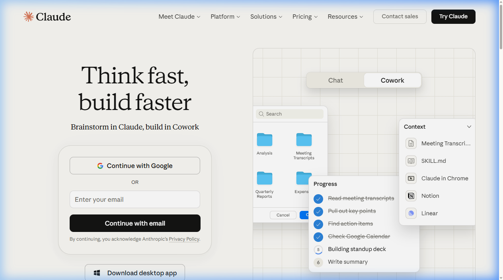

{.img-fluid .rounded}

[Claude.ai](https://claude.ai/) is de AI-assistent van [Anthropic](https://www.anthropic.com/), een bedrijf dat door voormalige OpenAI-medewerkers is opgericht met een expliciete focus op veilige en betrouwbare AI. Claude wordt als serieuze concurrent van ChatGPT beschouwd en staat bekend om zijn genuanceerde schrijfstijl, eerlijkheid over zijn eigen beperkingen en verwerking van lange documenten (groot contextvenster).

Ethisch redeneren: Anthropic publiceert hun [Constitutional AI-aanpak](https://www.anthropic.com/research/constitutional-ai-harmlessness-from-ai-feedback) open, interessant lesmateriaal over hoe je een AI "waarden" geeft. Het bedrijf heeft [onlangs nog een stevige aanvaring gehad](https://nos.nl/artikel/2604046-ruzie-tussen-het-pentagon-en-een-ai-bedrijf-waarvoor-mag-je-ai-inzetten) met de Amerikaanse overheid over de beperkingen die zij hanteren bij het gebruik van hun modellen door het Ministerie van Oorlog. 

## Gratis vs. betaald

De gratis versie geeft toegang tot het Claude Sonnet-model. Claude Pro biedt toegang tot het krachtigere Opus-model en hogere gebruikslimieten.

## Verwant

- [Claude Code](claude-code.qmd) — de variant van Claude die code schrijft en bewerkt in de terminal
- [ChatGPT](chatgpt.qmd) — de AI-assistent van OpenAI
- [Antigravity](antigravity.qmd) — de programmeeromgeving van Google die o.a. (gratis) toegang biedt tot op Claude gebaseerde modellen.
