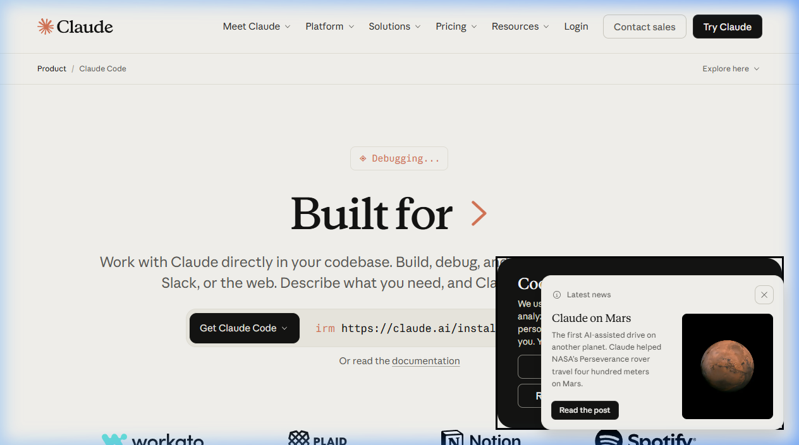

{.img-fluid .rounded}

[Claude Code](https://docs.anthropic.com/en/docs/claude-code) is de  AI-assistent van Anthropic die je kunt aanspreken vanuit de terminal (de opdrachtregel van je computer). In tegenstelling tot [Claude.ai](claude-ai.qmd), waar je een gesprek voert in een webbrowser, werkt Claude Code direct met de bestanden op je computer. Dit maakt het tot een krachtig hulpmiddel voor iedereen die websites, scripts of programma's willen bouwen zonder uitgebreide programmeerkennis, maar ook voor mensen die AI willen gebruiken om handelingen uit te voeren zoals het maken van video's (en dan echte bestanden, niet in de browser), het beantwoorden van e-mails, het maken van documenten, etc.

## Voor wie?

Claude Code is primair bedoeld voor ontwikkelaars en meer technisch onderlegde gebruikers. Op Youtube kun je een [constante stroom aan video's](https://www.youtube.com/results?search_query=claude+code) vinden van mensen die uitleggen waar zij Claude Code voor inzetten. De leercurve is wat steiler dan andere toepassingen, maar het is op dit moment dé applicatie voor wie hip wil zijn.
Voor een iets laagdrempeligere variant van vibecoding, zie ook [Google AI Studio](ai-studio.qmd) of [Antigravity](antigravity.qmd).

En anders, hier is een 10 uur durende tutorial die je op weg helpt om expert te worden:



::: {.callout-note}
## Moeten docenten dit leren?

Dat is een interessante vraag. Enerzijds is het goed om te weten wat er mogelijk is, anderzijds is het niet direct relevant voor iedereen. Het hangt sowieso af van je rol en interesses. Er zijn [voorbeelden van bedrijven](https://www.dutchitchannel.nl/news/720623/accenture-traint-30-000-specialisten-in-anthropics-claude-ai) waar tools als Claude Code officieel beschikbaar zijn gesteld voor medewerkers. Die medewerkers zullen in staat zijn om veel van de taken die zij anders handmatig uitvoeren te automatiseren. In een onderwijsomgeving zou je kunnen denken aan het automatiseren van het maken van toetsen, het nakijken van werk, het genereren van lesmateriaal, etc. 
Maar dat kan alleen als de onderwijsorganisatie ook de benodigde gebruiksafspraken maakt met Anthropic. 

:::

## Prijs

Claude Code werkt via de Anthropic API en is op verbruik geprijsd (per token) of via een abonnement. Er is geen gratis versie beschikbaar.
