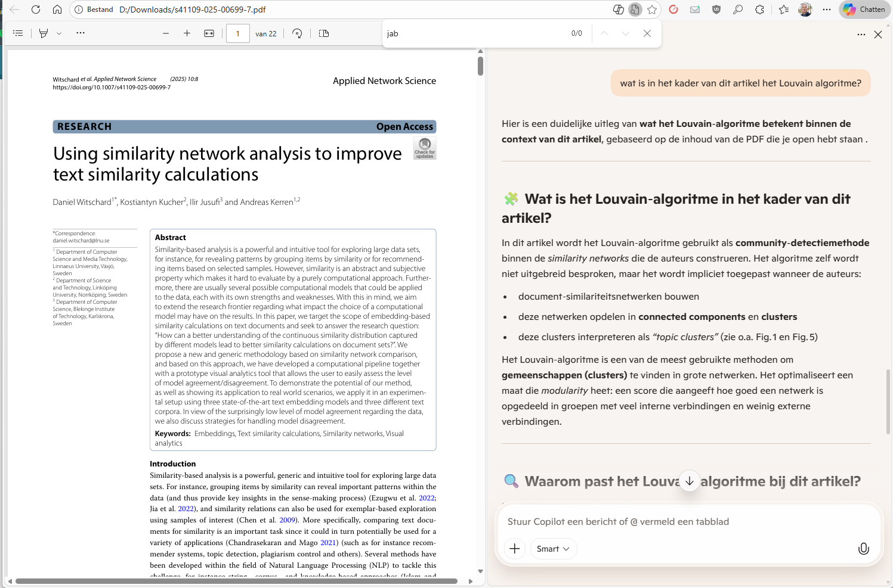

{.img-fluid .rounded}

[Microsoft Copilot](https://copilot.microsoft.com/) is de AI-assistent van Microsoft, gebaseerd op de modellen van OpenAI waar Microsoft een grote investeerder is. Copilot is gratis beschikbaar via de browser. Wie Microsoft 365 gebruikt (Word, PowerPoint, Outlook, Teams) zal Copilot steeds vaker tegenkomen als een geïntegreerde assistent binnen die toepassingen. Al moet daar nu in ieder geval nog apart voor betaald worden. 

## Copilot (gratis of betaald)

De gratis versie van Copilot is vergelijkbaar met ChatGPT: chatten, teksten schrijven, afbeeldingen genereren, webzoekopdrachten uitvoeren. Gratis beschikbaar op [copilot.microsoft.com](https://copilot.microsoft.com/). Die gratis versie is ook beschikbaar via de Edge-browser en Windows 11. Een toepassing die daar heel handig is, is dat je een PDF kunt openen in Edge en Copilot kunt vragen om de PDF samen te vatten, te parafraseren, etc.

 {.img-fluid .rounded}

De betaalde variant is geïntegreerd in Word, Excel, PowerPoint, Outlook en Teams. Hiermee kun je bv in Word een document laten samenvatten, herschrijven of uitbreiden, in PowerPoint een volledige presentatie laten genereren vanuit een tekstprompt of een bestaand Word-document, in Excel data laten analyseren, grafieken genereren, formules uitleggen, in Outlook e-mails samenvatten, reacties opstellen, en in Teams vergaderingen samenvatten, actiepunten extraheren.

::: {.callout-important}
## Aandachtspunt: privacy

Bij het gebruik van Copilot in Microsoft 365 verwerkt Microsoft je documenten en e-mails. Microsoft biedt voor scholen een Microsoft 365 Education-omgeving met extra privacygaranties. Controleer of je instelling hier gebruik van maakt voordat je leerlingendata via Copilot verwerkt. SURF adviseert onderwijsinstellingen (september 2025) om hier voorlopig voorzichtig mee om te gaan. Zie ook [deze pagina](https://www.surf.nl/themas/privacy-en-security/privacy-en-ai-in-het-onderwijs). 

:::