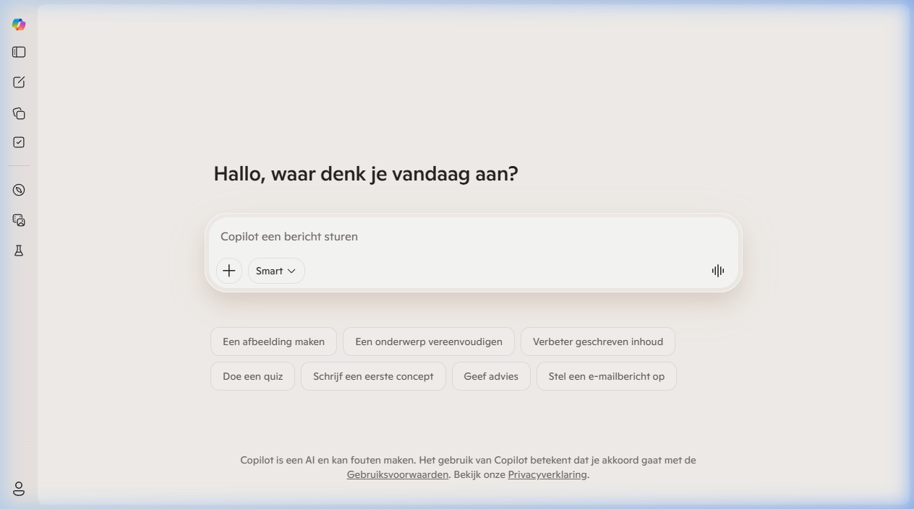

{.img-fluid .rounded}

[Microsoft Copilot](https://copilot.microsoft.com/) is de AI-assistent van Microsoft, gratis beschikbaar via de browser. Wie Microsoft 365 gebruikt (Word, PowerPoint, Outlook, Teams) zal Copilot steeds vaker tegenkomen als een geïntegreerde assistent binnen die toepassingen.

## Twee smaken

**Copilot (gratis, via browser)**
Vergelijkbaar met ChatGPT: chatten, teksten schrijven, afbeeldingen genereren (via DALL·E), webzoekopdrachten uitvoeren. Gratis beschikbaar op [copilot.microsoft.com](https://copilot.microsoft.com/).

**Microsoft 365 Copilot (betaald)**
De betaalde variant is geïntegreerd in Word, Excel, PowerPoint, Outlook en Teams. Hiermee kun je:

- In **Word**: een document laten samenvatten, herschrijven of uitbreiden
- In **PowerPoint**: een volledige presentatie laten genereren vanuit een tekstprompt of een bestaand Word-document
- In **Excel**: data laten analyseren, grafieken genereren, formules uitleggen
- In **Outlook**: e-mails samenvatten, reacties opstellen
- In **Teams**: vergaderingen samenvatten, actiepunten extraheren

## Gratis vs. betaald

| Variant | Beschikbaar? |
|---|---|
| Copilot.microsoft.com | Gratis |
| Copilot in Windows | Gratis (Windows 11) |
| Microsoft 365 Copilot | Betaald (licentie via organisatie) |

## Aandachtspunt: privacy

Bij het gebruik van Copilot in Microsoft 365 verwerkt Microsoft je documenten en e-mails. Microsoft biedt voor scholen een **Microsoft 365 Education**-omgeving met extra privacygaranties. Controleer of je instelling hier gebruik van maakt voordat je leerlingendata via Copilot verwerkt.
