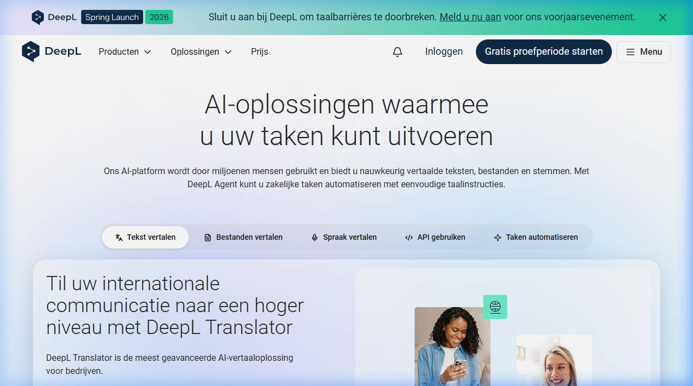

{.img-fluid .rounded}

[DeepL](https://www.deepl.com/) is een AI-vertaaldienst die door taalwetenschappers en vertalers consequent als de **beste automatische vertaler** wordt beoordeeld — boven Google Translate voor Europese taalcombinaties. DeepL is ontwikkeld in Keulen en gebruikt een neuraal netwerk dat is getraind op professionele vertalingen.

## Wat kun je ermee?

- **Tekst vertalen** in de browser of via de desktop-app
- **Documenten vertalen** (Word, PDF, PowerPoint) waarbij de opmaak behouden blijft
- **DeepL Write**: AI-suggesties voor stijl, woordkeuze en grammatica in het Engels of Duits

## Waarom interessant voor leraren?

- Lesmaterialen uit het Engels vertalen naar het Nederlands (of omgekeerd)
- Studenten die anderstalige bronnen gebruiken kunnen ze betrouwbaarder vertalen
- Vergelijken van DeepL-vertalingen met Google Translate: wanneer zijn de verschillen significant?
- Als brug bij tweetalige of meertalige klassen

De gratis versie is voor incidenteel gebruik vaak ruim voldoende.

## Kanttekening

DeepL is zeer betrouwbaar voor standaard Europese talen, maar minder sterk in minder courante talen. Voor Arabisch, Chinees of Swahili zijn andere tools beter. Controleer altijd vertalingen van gevoelige of formele documenten.
