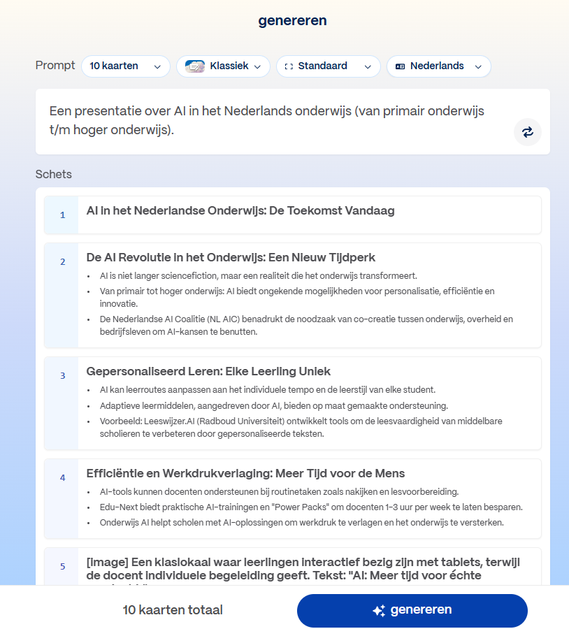

{.img-fluid .rounded}

[Gamma](https://gamma.app/) is een webgebaseerde presentatietool waarbij je vanuit een tekstprompt of bestaande tekst in enkele minuten een volledige, visueel aantrekkelijke presentatie, document of webpagina genereert. Het resultaat is direct bewerkenbaar en deelbaar via een link. Eigenlijk dus wat je met [NotebookLM](notebooklm.qmd) ook kunt, maar dan met een wat ander startpunt.

## Hoe werkt het?

1. Beschrijf je onderwerp (of plak een tekst)
2. Kies een stijl en kleurenpalet
3. Gamma genereert een volledige presentatie met titels, bullet points, afbeeldingen en opmaak
4. Pas individuele slides aan via een eenvoudige editor

Gamma maakt gebruik van AI voor zowel de tekst als de beeldkeuze. Je kunt ook afbeeldingen laten genereren met Nano Banana via Gamma's ingebouwde beeldgenerator. Belangrijk verschil met NotebookLM is dat je bij Gamma eerst een tekstueel overzicht krijgt en dan pas de presentatie. Bij NotebookLM krijg je direct een presentatie met de mogelijkheid om daarna dia's aan te passen.

{.img-fluid .rounded}

## Gratis of betaald

De gratis versie volstaat voor af en toe een presentatie genereren. Je presentaties krijgen dan wel een "Made with Gamma" badge (die eenvoudig te verwijderen is bij export naar PowerPoint). Een belangrijk ander verschil met NotebookLM is dat de dia's die je dan krijgt in PowerPoint écht tekst en objecten bevatten die je kunt bewerken. Bij NotebookLM is de export naar PowerPoint nog heel nieuw en beperkter omdat elke dia uit één complete afbeelding bestaat. 