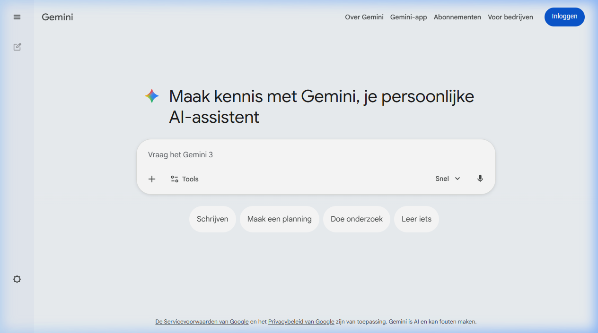

{.img-fluid .rounded}

[Google Gemini](https://gemini.google.com/) is de AI-assistent van Google — vergelijkbaar met ChatGPT, maar geïntegreerd in het Google-ecosysteem. Wie al gebruikmaakt van Google Docs, Google Drive, Gmail of Google Classroom, zal merken dat Gemini steeds meer in die tools verschijnt.

## Wat kan Gemini?

- **Chatten** over vrijwel elk onderwerp
- **Documenten samenvatten** die in je Google Drive staan
- **E-mails opstellen** in Gmail
- **Onderzoeken** via [Deep Research](https://gemini.google/overview/deep-research/) — een grondige, meerstaps-zoekfunctie die bronnen samenvoegt
- **Afbeeldingen genereren** via [Nano Banana](nano-banana.qmd)
- **Video's genereren** via [Veo 3.1](veo.qmd)
- **Muziek genereren** via de muziekgenerator
- **Live gesprekken** voeren via Gemini Live
- **Presentaties en documenten** ontwerpen via Canvas

Gemini is daarmee niet één tool, maar een **platform** met een groeiend aantal functies.
Scholen die Google Workspace for Education gebruiken, krijgen Gemini in een aparte, veilige schoolomgeving aangeboden. Leerlingendata worden dan niet gebruikt voor het trainen van Google's modellen. 

## Verwant

- [Google AI Studio](ai-studio.qmd) — de ontwikkelomgeving, direct toegang tot Gemini-modellen
- [Google NotebookLM](notebooklm.qmd) — bronnen uploaden, samenvatten en bevragen
- [Nano Banana](nano-banana.qmd) — beeldgeneratie via Gemini
- [Veo](veo.qmd) — videogeneratie via Gemini
