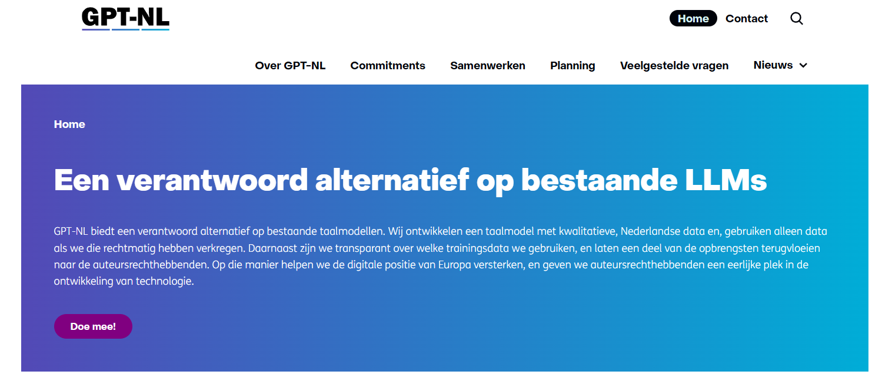

{.img-fluid .rounded}

GPT-NL is een publiek gefinancierd initiatief (13,5 miljoen euro via RVO/EZK) om een eigen, transparant ecosysteem voor Nederland te creëren.

GPT-NL onderscheidt zich van commerciële modellen door een focus op de Nederlandse taal en cultuur:

- Soevereiniteit: Vermindert de afhankelijkheid van buitenlandse partijen en versterkt de digitale positie van Europa.
- Transparantie: Openheid over keuzes in datacuratie, het trainingsproces en ethische kaders (voorkomen van bias).
- Betrouwbaarheid: Gebruik van kwalitatieve, rechtmatig verkregen data.
- Wederkerigheid: Een deel van de opbrengsten vloeit terug naar de auteursrechthebbenden van de gebruikte trainingsdata.

## Verschil met andere tools

In tegenstelling tot veel 'black box' modellen, maakt GPT-NL de onderliggende techniek inzichtelijk (dat is het doel tenminste). Het is eenvoudig om te denken "waarom doen we zo veel moeite als ik toch ook gewoon de bestaande commerciële modellen kan gebruiken?". Recente ontwikkelingen hebben duidelijk gemaakt dat het voor Europa en Nederland belangrijk is om een eigen AI-ecosysteem te hebben. Anders zijn we afhankelijk van buitenlandse partijen die op hun beurt weer onderdeel zijn van het politieke systeem van hun land. AI valt dan in dezelfde categorie als bijvoorbeeld energie en defensie. Daarnaast zit er een meer ideologische kant achter: wat vind je een eerlijk systeem als het gaat om het gebruik van data van anderen voor het trainen van AI-modellen? 

Uitdaging hierbij is dat Nederland eigenlijk al heel erg laat is begonnen met het ontwikkelen van eigen AI-modellen. De VS en China zijn al veel verder, steken er veel meer geld in en hebben modellen die nu vandaag al meteen commercieel bruikbaar zijn. Het is dus de vraag of dit model kan concurreren met die andere modellen. 

Op dit moment (voorjaar 2026) kun je GPT-NL nog niet zelf testen. [Meer informatie vind je op de website van GPT-NL](https://gpt-nl.org/).

::: {.callout-note}
## Hoe open wil je het hebben?

GPT-NL heeft zich heel expliciet als doel getsteld om transparant te zijn over de keuzes die gemaakt worden in het trainen van de modellen. Naast modellen zoals ChatGPT en Claude waarvan je niet weet hoe ze getraind zijn en op welke data, zijn er ook (commerciële) modellen die je zelf, lokaal kunt draaien. Dat vergt dan wel stevige hardware en op dit moment zijn de resultaten niet altijd zo goed als de antwoorden die je van de online commerciële modellen krijgt. Een voorbeeld van zo'n model dat je lokaal kunt draaien is [Whisper](whisper.qmd) van OpenAI waarmee je spraak kunt omzetten in tekst. Dit model is heel specifiek getraind voor die ene taak en doet dat heel goed. En omdat het niet zo'n heel groot model is, kun je het ook op een laptop draaien. Het voordeel van lokaal draaien van zo'n model is dat het audiobestand (spraak is een persoonsgegeven!) niet naar een externe server hoeft.

:::