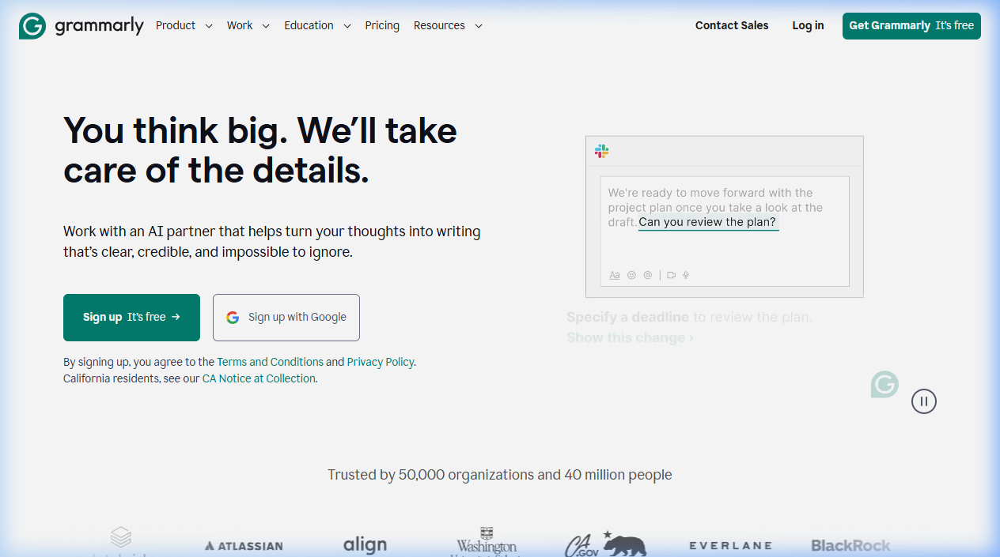

{.img-fluid .rounded}

[Grammarly](https://www.grammarly.com/) is een AI-schrijfassistent die je tekst in realtime controleert op grammatica, spelling, stijl, toon en duidelijkheid. Het werkt als browserextensie (Chrome, Firefox, Edge, Safari), als desktop-app en als plug-in voor Microsoft Office en Google Docs.

Grammarly is primair gericht op **Engels**, maar heeft ook beperkte ondersteuning voor andere talen.

## Wat doet Grammarly?

- Correctie van grammatica en spelfouten
- Stijlsuggesties: te lange zinnen, passieve constructies, herhalingen
- Toon-analyse: klinkt je tekst formeel genoeg? Vriendelijk? Direct?
- Plagiaatcontrole (betaalde versie)
- **Grammarly Go**: AI-schrijfhulp — genereer, herschrijf of verbeter hele alinea's

## Educatieve toepassingen

- Studenten die een Engelstalig paper schrijven leren van de directe feedback
- Docenten van engelse taalvakken kunnen Grammarly inzetten als oefenomgeving
- Discussie: wanneer is Grammarly-gebruik "helpen jezelf verbeteren" en wanneer is het "valsspelen"? — goed gesprek voor mediawijsheid

## Gratis vs. betaald

De gratis versie dekt het grootste deel van de grammatica- en spellingcontrole. Grammarly Premium voegt stijlsuggesties, plagiaatcontrole en geavanceerde toonanalyse toe. Grammarly for Education biedt groepslicenties voor instellingen.

## Vergelijking

| Tool | Sterk in | Talen |
|---|---|---|
| Grammarly | Stijl, toon, academisch schrijven | Engels (primair) |
| [DeepL Write](deepl.qmd) | Herschrijven en alternatieven | EN, DE |
| Microsoft Editor | Integratie met Office 365 | Meerdere talen |
