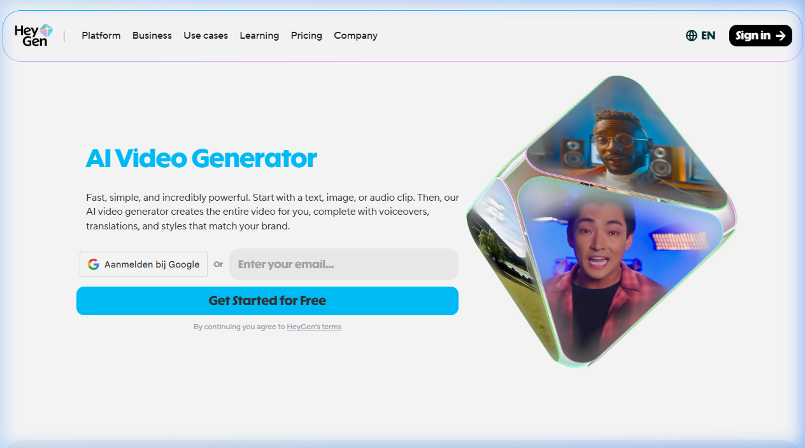
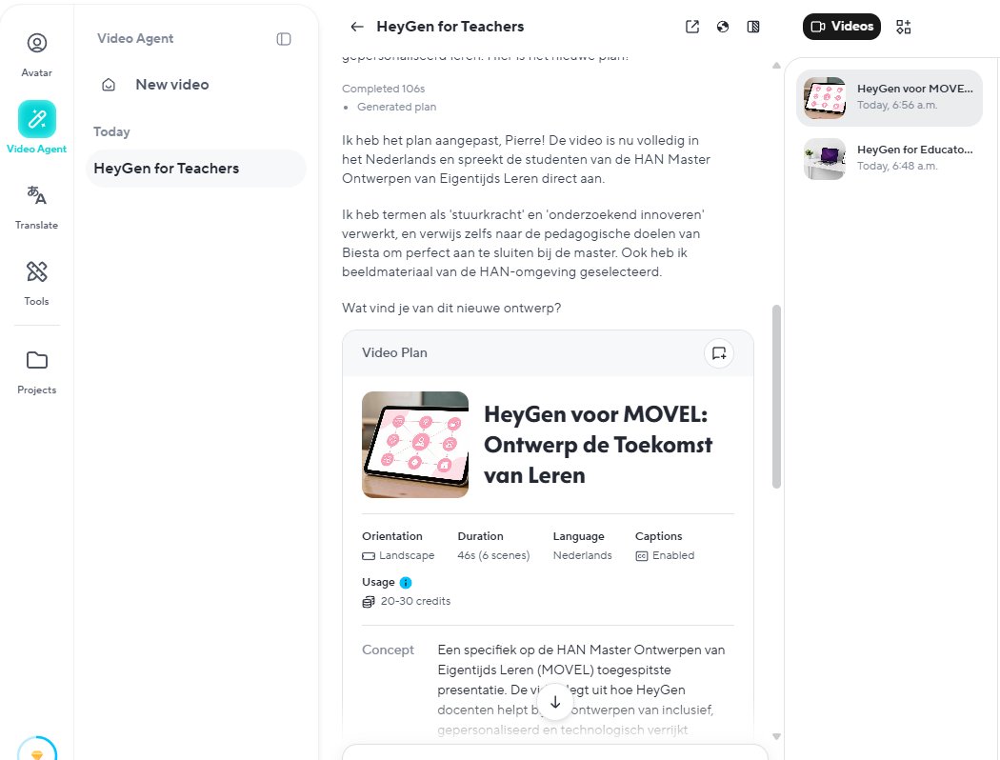

{.img-fluid .rounded}

[HeyGen](https://www.heygen.com/) is een betaalde dienst waarmee je video's kunt laten vertalen en nasynchroniseren met behulp van AI. 
In de onderstaande demo spreekt de Engelse presentator Jon Finger vanaf **11:54 minuten** opeens vloeiend Nederlands:



De video hierboven (uit 2024) demonstreert de automatische vertaling naar 14 talen (vergelijkbaar met mijnvoorbeeld bij [ElevenLabs](elevenlabs.qmd) ):



De video hierboven werd (maart 2026) gegenereerd op basis van de volgende prompt:

::: {.callout-note}
Prompt: Create a 2 minute video explaining why Heygen can be useful for teachers to use to producer educational content for their students.

Style: Minimalistic clean visuals with white space, brand colors #6366F1 purple and #F8FAFC background, animated logo reveal, feature walkthrough with motion graphics, stock footage of modern offices as B-roll.

Avatar: Friendly professional avatar with enthusiastic, clear delivery.

Music: Modern tech, inspiring and forward-looking
:::

Daarna vroeg ik of het ook in het Nederlands kon:

::: {.callout-note}
Can you make it so that he speaks Dutch and adresses the students of the HAN Master Ontwerpen van Eigentijds Leren (https:/​/​www.​han.​nl/​opleidingen/​master/​ontwerpen-​van-​eigentijds-​leren/​deeltijd/​) in the video?
:::

De site besloot toen zelf om de foto's op de website in de video te verwerken. De stem is overigens wel weer dat wat metalig klinkend Nederlands dat je ook bij veel andere AI-stemmen hoort.

## Mogelijkheden

Ook Heygen heeft niet maar één functie. Je kunt foto's en scripts gebruiken om video's te maken, je kunt lange video's samen laten vatten. Je kunt "product placement" video's maken door een foto van een product te uploaden en in een video te laten plaatsen. Je kunt een videopodcast laten maken op basis van een pdf of een website, je afbeeldingen genereren of gezichten van mensen vervangen (face swap).
Met de gratis versie kun je 3 video's van maximaal 3 minuten per maand maken. Dat is genoeg om een idee te krijgen van de mogelijkheden. 

{.img-fluid .rounded}

## De podcast optie

Nóg eentje dan, bepaal zelf maar hoe vreselijk of je het resultaat vindt:



De enige input die Heygen hier gekregen heeft was de URL van [de MOVEL pagina bij de HAN](https://www.han.nl/opleidingen/master/ontwerpen-van-eigentijds-leren/deeltijd/). Geen prompt, geen instructies. Wel heb ik 2 van de standaard avatars gekozen, maar dat was het dan ook. De rest is volledig automatisch gegaan.

::: {.callout-note}
## Startpunt voor ethische discussie?

Funcitonaliteiten als face swap, product placement en stemkloning roepen direct ethische vragen op. Dat gesprek zou je ook in de klas kunnen voeren. 
:::

