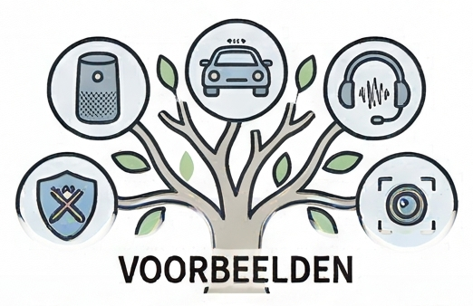

{.lightbox height="200px"}

De ontwikkelingen op het gebied van AI gaan zo snel dat elk overzicht achterhaald is zodra het online verschijnt. Desondanks geven de onderstaande voorbeelden een goede indruk van wat er mogelijk is — en hoe breed het landschap van AI-toepassingen inmiddels is.

Gebruik dit overzicht als **startpunt**, niet als eindpunt. Klik in de zijbalk op een tool om er meer over te lezen.

## Chatten, schrijven en zoeken

- [ChatGPT](chatgpt.qmd) — de bekendste AI-chatbot, van OpenAI
- [Claude.ai](claude-ai.qmd) — serieuze concurrent van Anthropic
- [Google Gemini](gemini.qmd) — Google's AI-assistent
- [Microsoft Copilot](copilot.qmd) — de AI-assistent van Microsoft
- [GPT-NL](gpt-nl.qmd) — een Nederlands taalmodel

## Vertalen en schrijven verbeteren

- [DeepL](deepl.qmd) — Vertalen met AI
- [Grammarly](grammarly.qmd) — AI-schrijfassistent voor correct Engels

## Presentaties en visuele communicatie

- [Gamma.app](gamma.qmd) — genereer een complete presentatie vanuit een prompt
- [Canva AI](canva-ai.qmd) — AI-functies in de populaire ontwerpapp voor leraren
- [Napkin AI](napkin-ai.qmd) — zet tekst automatisch om in schema's en infographics

## Genereren van afbeeldingen

- [Nano Banana 2](nano-banana.qmd) — Google's beeldgenerator, via Gemini
- [Midjourney](midjourney.qmd) — artistieke kwaliteit, via Discord en web
- [This [...] Does Not Exist](this-does-not-exist.qmd) — GAN-modellen die niet-bestaande gezichten genereren
- [Magic Eraser](magic-eraser.qmd) — objecten verwijderen uit foto's

## Genereren van audio en spraak

- [ElevenLabs](elevenlabs.qmd) — tekst-naar-spraak en stemkloning
- [Whisper](whisper.qmd) — spraak-naar-tekst (transcriptie), open-source van OpenAI
- [Suno](suno.qmd) — genereer volledige muzieknummers met zang vanuit een tekstprompt

## Genereren van video en avatars

- [Gemini Veo 3.1](veo.qmd) — Google's videogenerator met geluid
- [Runway ML](runway-ml.qmd) — creatieve videobewerkingen en transformaties
- [Kling AI](kling-ai.qmd) — hoge kwaliteit video's tot 2 minuten
- [Invideo AI](invideo-ai.qmd) — complete video met voice-over uit een prompt
- [HeyGen](heygen.qmd) — video vertalen en nasynchroniseren in andere talen
- [Synthesia](synthesia.qmd) — instructievideo's met AI-avatars, zonder camera
- [Wav2Lip](wav2lip.qmd) — vroeg (2020) lipsync-model dat foto's laat praten
- [Wavespeed](https://wavespeed.ai/) - geen abonnement maar credits kopen
- [Imagine.art](https://www.imagine.art/) - uitgebreide opties, geen gratis versie

## Onderzoek en kennisbeheer

- [Google NotebookLM](notebooklm.qmd) — bronnen uploaden en er een podcast, samenvatting of quiz van laten maken
- [Perplexity AI](perplexity.qmd) — AI-zoekmachine

## Voor de technisch geïnteresseerde lezer

- [Google AI Studio](ai-studio.qmd) — ontwikkelplatform van Google
- [Teachable Machine](teachable-machine.qmd) — train zelf een eenvoudig ML-model, zonder code
- [Claude Code](claude-code.qmd) — AI-assistent die zelfstandig code schrijft en bewerkt
- [Antigravity](antigravity.qmd) — de tool waarmee deze module is gebouwd
- [OpenClaw](openclaw.qmd) — een open-source AI-assistent

