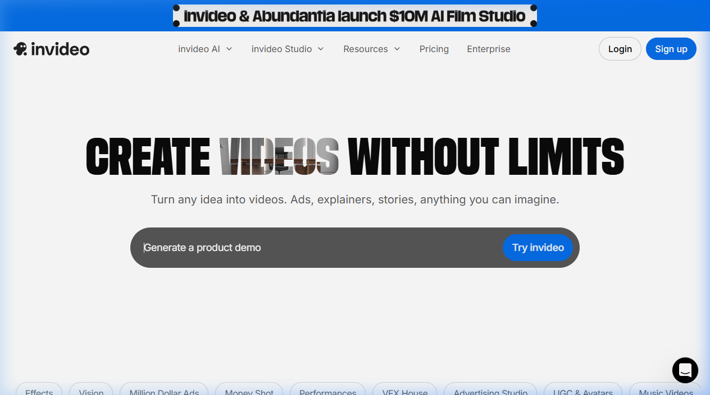

{.img-fluid .rounded}

[Invideo AI](https://ai.invideo.io/) is een van de meest toegankelijke platforms om met een simpele tekstprompt een complete video met voice-over te genereren. Je geeft aan wat het onderwerp is, voor welk publiek de video bedoeld is en hoe lang hij moet zijn — de rest doet de AI.

De video hieronder laat zien wat de mogelijkheden waren begin 2026.



## Hoe werkt het?

1. **Prompt invoeren**: omschrijf het onderwerp, de doelgroep en de gewenste toon
2. **AI genereert een script**: inclusief structuur en voice-over tekst
3. **Automatische montage**: de AI zoekt passende stockbeelden en -video's en monteert alles aan elkaar
4. **Voice-over**: gegenereerde stem in meerdere talen en stijlen
5. **Bewerken**: je kunt het gegenereerde resultaat nog aanpassen via de editor

## Mogelijkheden en beperkingen

Invideo AI is bijzonder geschikt voor het snel maken van **informatieve of uitlegvideo's**, social media content en YouTube-video's. De kwaliteit van de stockbeelden is sterk afhankelijk van hoe specifiek je prompt is. Voor educatieve toepassingen geldt: de gegenereerde content is een startpunt, niet het eindproduct — controleer altijd het script op feitelijke juistheid.

Er is een gratis laag beschikbaar met beperkt aantal exports per maand. Voor hogere kwaliteit en meer functionaliteit zijn betaalde abonnementen beschikbaar.
