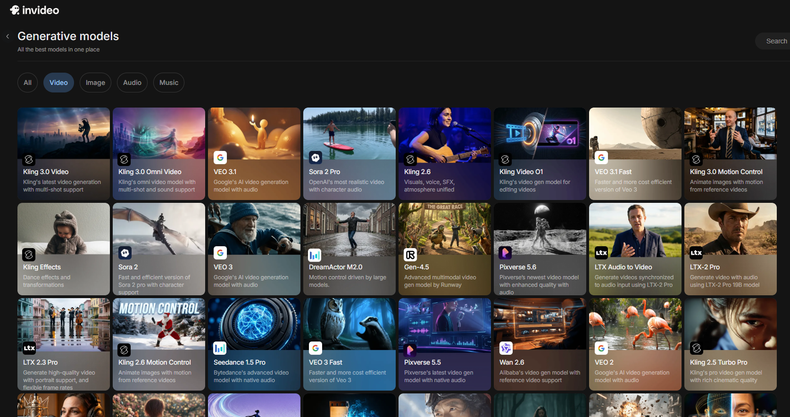
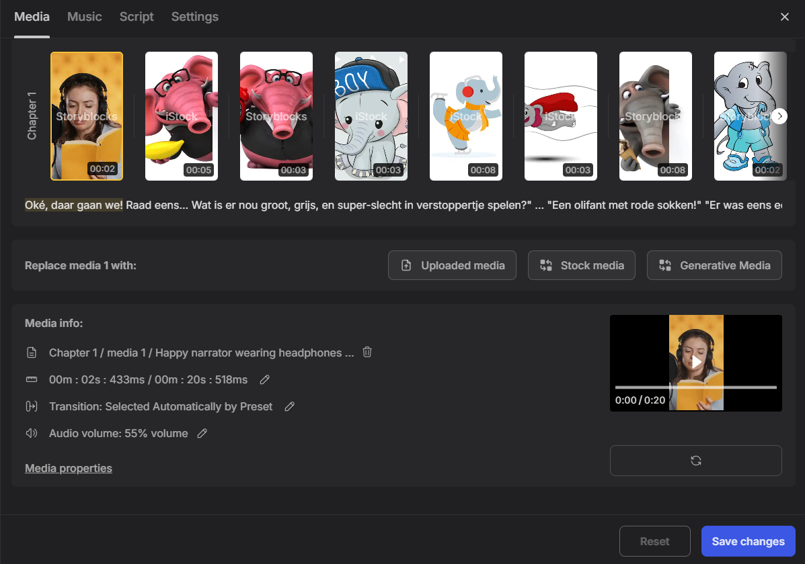

{.img-fluid .rounded}

[Invideo AI](https://ai.invideo.io/) is een online dienst waarmee je met een tekstprompt een complete video met voice-over kunt genereren. Je geeft aan wat het onderwerp is, voor welk publiek de video bedoeld is en hoe lang hij moet zijn, de rest doet de AI. Je bent nie tbeperkt tot één of een paar modellen, je hebt een groot aantal verschillende modellen voor video, afbeeldingen, audio en muziek ter beschikking, onder andere [Veo 3.1](veo.qmd), [Kling](kling-ai.qmd), [Nano Banana 2](nano-banana.qmd) en stemmodellen van [ElevenLabs](elevenlabs.qmd).
Je kunt ook gebruik maken van stockbeelden die niet door AI zijn gegenereerd of je eigen media uploaden.

{.img-fluid .rounded}

De video hieronder laat zien wat de mogelijkheden waren begin 2026.



Er is een gratis optie beschikbaar met beperkt aantal exports per maand. Voor hogere kwaliteit en meer functionaliteit zijn betaalde abonnementen beschikbaar.

{.img-fluid .rounded}

Met de stockafbeeldingen optie krijg je weliswaar een resultaat, maar niet echt een video die ik in een les zou willen gebruiken.
