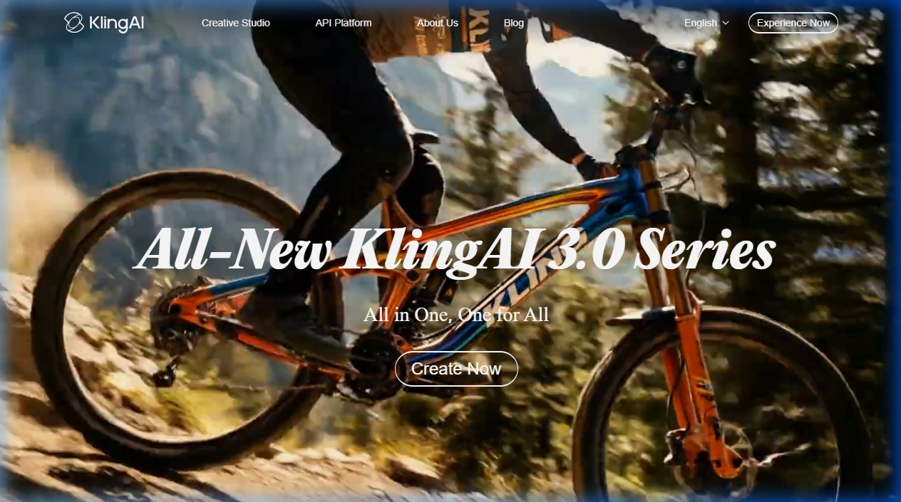

{.img-fluid .rounded}

[Kling AI](https://klingai.com/) is een Chinese AI-videogenerator van Kuaishou Technology die in 2024 internationaal de aandacht trok door de **hoge kwaliteit en lengte** van de gegenereerde video's. Waar concurrenten video's van 4–8 seconden produceren, kan Kling video's genereren tot **2 minuten** lang.

## Wat maakt Kling bijzonder?

- **Lange video's**: tot 2 minuten, veel langer dan de meeste concurrenten
- **Tekst naar video en foto naar video**: genereer een video vanuit een tekstprompt of animeer een stilstaande foto
- **Lip Sync**: laat personages in een video praten op basis van een audio-opname
- **Camerabewegingen**: stel specifieke camerabeweging in (zoom, pan, tracking shot)
- **Kwalitatief sterk**: staat bekend om realistische beweging en goede temporele consistentie (mensen bewegen logisch over de frames heen)

## Gratis vs. betaald

Kling heeft een **gratis tier** waarmee je dagelijks een beperkt aantal video's kunt genereren. Het betaalde plan geeft meer generaties en hogere resolutie.

## Educatieve toepassingen

- Illustreer een historische scène of wetenschappelijk concept via een korte video
- Laat studenten nadenken over de grens tussen real footage en AI-gegenereerd beeldmateriaal
- Combineer met [ElevenLabs](elevenlabs.qmd) voor een volledig AI-gegenereerde "documentaire"

## Aandachtspunten

Kling is ontwikkeld door een Chinees bedrijf. Dit roept vragen op over dataverwerking en privacy. Gebruik geen gevoelige of persoonsgebonden informatie bij het genereren van video's.

## Vergelijking

| Tool | Max lengte | Met geluid? | Gratis? |
|---|---|---|---|
| Kling AI | 2 minuten | ✅ (lip sync) | ✅ beperkt |
| [Veo 3.1](veo.qmd) | ~8 seconden | ✅ | ❌ (Pro nodig) |
| [Runway ML](runway-ml.qmd) | 10 seconden | ❌ | ✅ beperkt |
| [HeyGen](heygen.qmd) | Onbeperkt | ✅ | ✅ beperkt |
