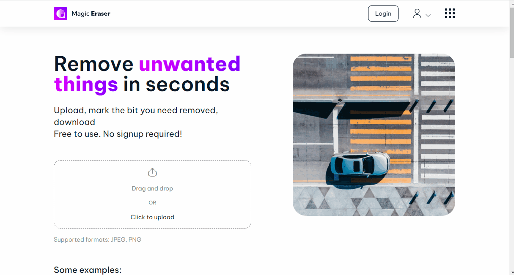

{.img-fluid .rounded}

[Magic Eraser](https://magicstudio.com/magiceraser/) is een gratis website waarmee je eenvoudig objecten uit een foto kunt verwijderen met behulp van AI. Je streept globaal het te verwijderen object aan, de AI herkent het object en verwijdert het — de lege plek wordt automatisch ingevuld met een passende achtergrond.

{fig-alt="Animatie die laat zien hoe Magic Eraser werkt"}

::: {.callout-note}
## Startpunt voor ethische discussie?

Magic Eraser illustreert perfect hoe eenvoudig het is om foto's te manipuleren — zonder enige technische kennis. Dit is een uitstekend startpunt voor discussies over de betrouwbaarheid van beeldmateriaal in het nieuws, op sociale media en in de rechtszaal.
:::
