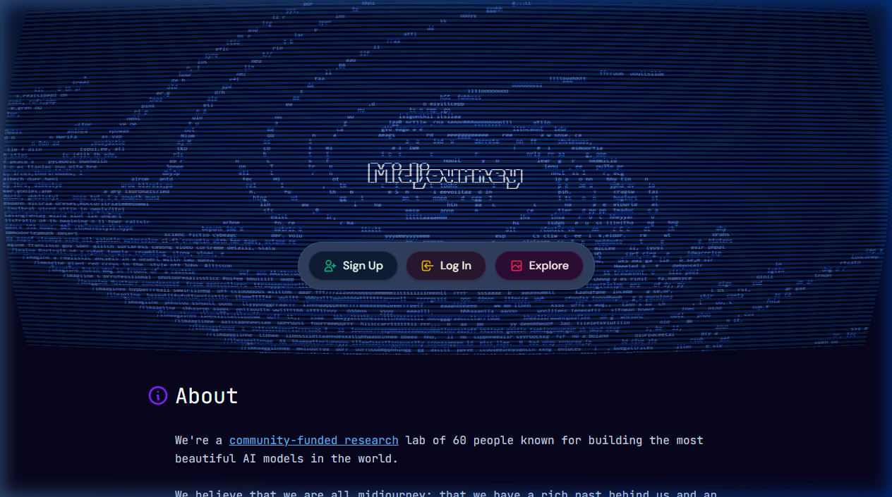
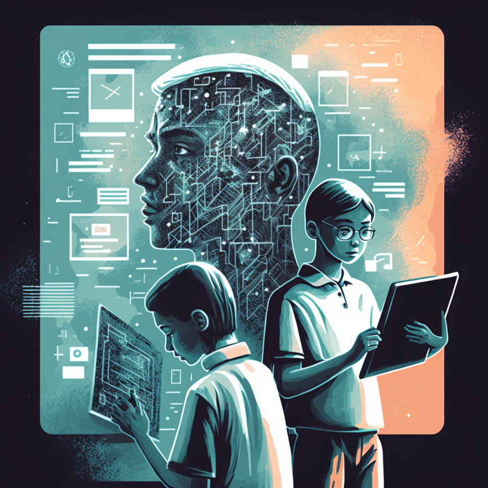

{.img-fluid .rounded}

[Midjourney](https://midjourney.com/) is een van de meest gebruikte en hoogst gewaardeerde AI-beeldgeneratoren. Het staat bekend om zijn **artistieke kwaliteit** en fotorealistisch consistent resultaten — en dat zagen velen voor jaren als de beste output van alle beschikbare beeldgeneratoren.

{fig-alt="Animatie met door Midjourney gegenereerde afbeeldingen"}

{fig-alt="Afbeelding gegenereerd door Midjourney op basis van de prompt over AI en onderwijs"}

*Prompt gebruikt voor bovenstaande afbeelding: **AI, education, personalized learning, student data, grading, human instructors, traditional teaching, ethical considerations***

## Hoe werkt het?

Midjourney werkte lange tijd uitsluitend via een **Discord-server**: je trad toe tot de Discord-community, stuurde een prompt naar de Midjourney-bot en ontving vier variaties op basis van je beschrijving. In 2024 is hiernaast een webinterface beschikbaar gekomen op [midjourney.com](https://www.midjourney.com/), die steeds verder ontwikkeld wordt.

## Kwaliteit en stijlen

Midjourney blinkt uit in:
- **Fotorealistische** portretten en landschappen
- **Artistieke** stijlen (olieverf, waterverf, art nouveau, etc.)
- **Architectuur** en interieurvisualisaties
- **Conceptuele** en surreële beelden

Versie 6 en nieuwer (2024-2025) ondersteunt ook tekst-in-afbeelding en personage-consistentie over meerdere gegenereerde afbeeldingen.

## Prijs

Midjourney heeft **geen gratis laag** meer (na een korte testfase in 2023). Een basisabonnement kost circa $10 per maand. Voor gevorderden zijn hogere tiers beschikbaar met meer generaties per maand en commerciële rechten.

## Inspiratie opdoen

Kijk op [Midjourney Showcase](https://www.midjourney.com/showcase) of communities als [r/midjourney](https://www.reddit.com/r/midjourney/) voor voorbeelden van wat anderen maken en hoe hun prompts eruitzien.
