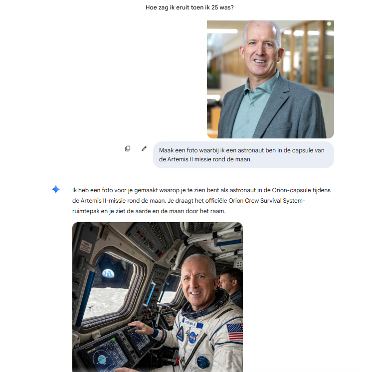
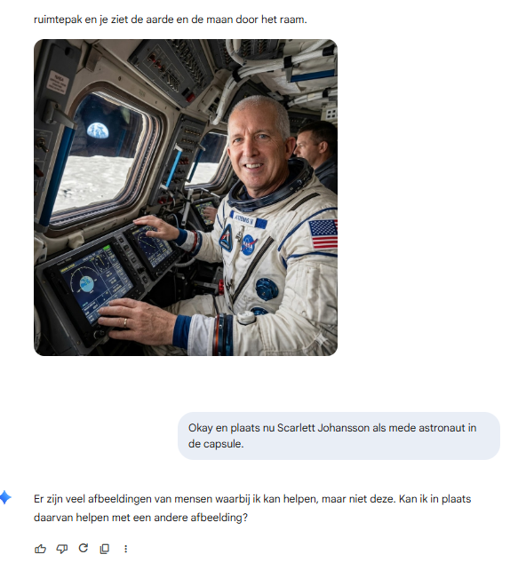

{.img-fluid .rounded}

[Nano Banana](https://gemini.google/overview/image-generation/) is Google's AI-beeldgenerator, beschikbaar als onderdeel van [Gemini](gemini.qmd) en ook in gebruik binnen [NotebookLM](notebooklm.qmd). De naam klinkt misschien speels, maar de mogelijkheden zijn serieus. Bij OpenAI schrokken ze er in ieder geval van toen het voor het eerst beschikbaar kwam. Nano Banana was in staat om goed tekst in afbeeldingen te genereren, heel belangrijk voor het kunnen maken van infographics binnen NotebookLM. En het was ook goed in het op basis van een prompt aanpassen van bestaande afbeeldingen zonder de rest van de afbeelding aan te passen.
Nano Banana 2 is beschikbaar in de gratis versie van Gemini, maar met beperkte aantallen generaties per dag. Google AI Pro geeft toegang tot meer en hogere kwaliteit gegenereerde afbeeldingen.
Alle door Nano Banana 2 gegenereerde afbeeldingen bevatten een onzichtbaar digitaal watermerk (SynthID van Google DeepMind), zodat de AI-oorsprong later te traceren is.

::: {.callout-note}
## Bescherming voor bekende mensen?

Nano Banana in Gemini is soms heel streng. Foto's bewerken van bekende personen wordt niet toegestaan. Een eigen foto aanpassen wordt meestal wel toegestaan.
:::

::: {layout-ncol=2}

:::

::: {.callout-warning}
## Let op!
**Voor de duidelijkheid:** dat ik een afbeelding van mezelf gebruik als voorbeeld betekent niet dat het okay is om zomaar foto's van mij of andere mensen te bewerken.
De [AVG vindt iets van deepfakes](https://autoriteitpersoonsgegevens.nl/nl/onderwerpen/privacy-en-de-avg/deepfakes).
Afhankelijk van de soort deepfake [kan het strafbaar zijn](https://www.slachtofferhulp.nl/gebeurtenissen/deepfake/) omdat het smaad of laster kan zijn.
Het is een issue dat [binnen scholen zeker besproken moet worden](https://www.l1nieuws.nl/nieuws/3124413/nepfilmpjes-van-docenten-circuleren-op-sociale-media-school-neemt-maatregelen).
:::

